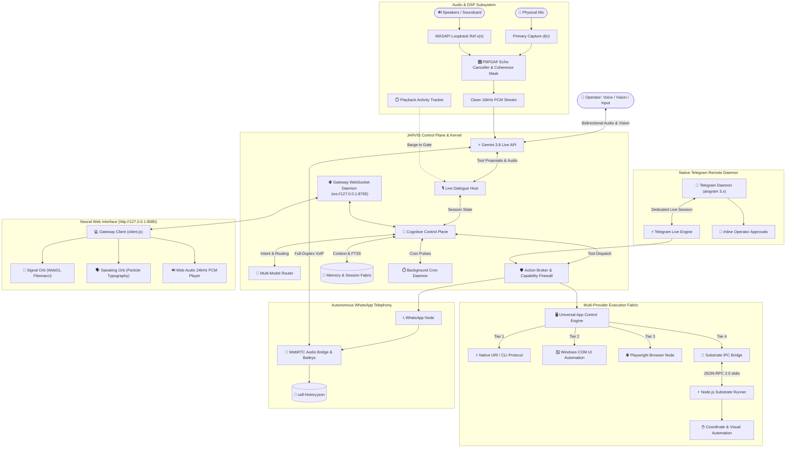
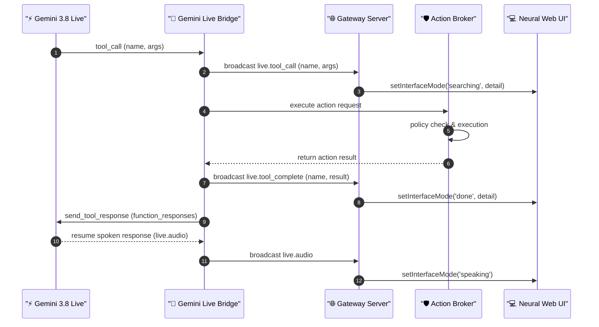
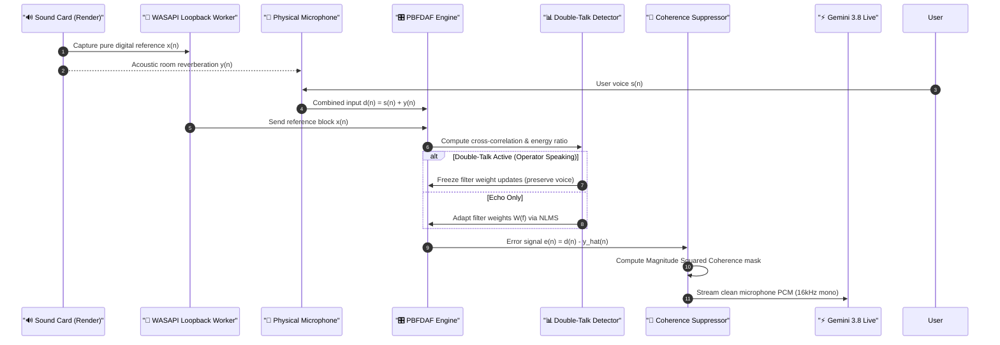
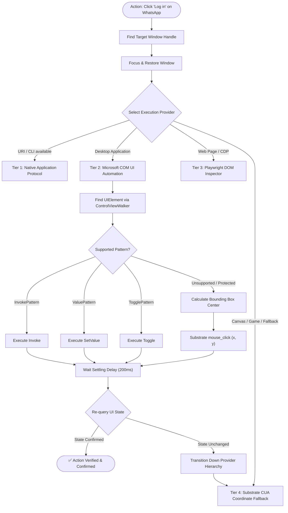
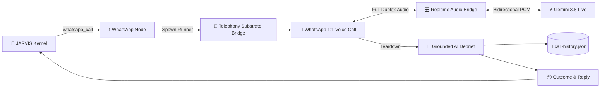
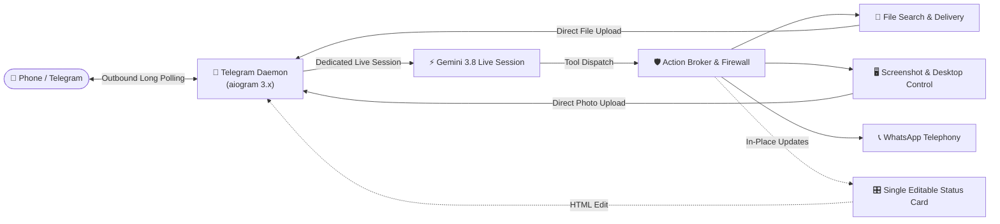
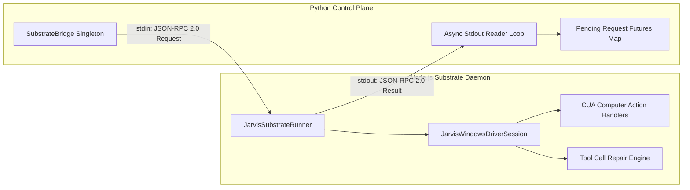
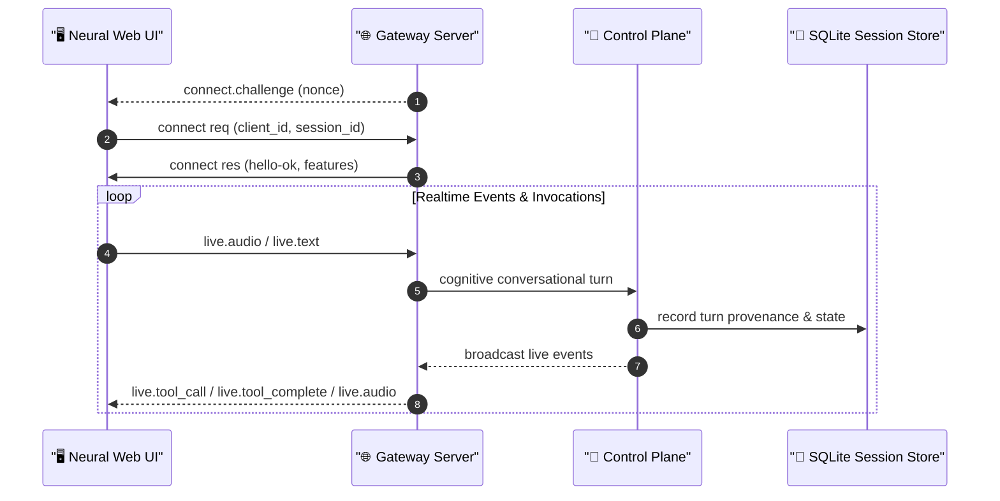
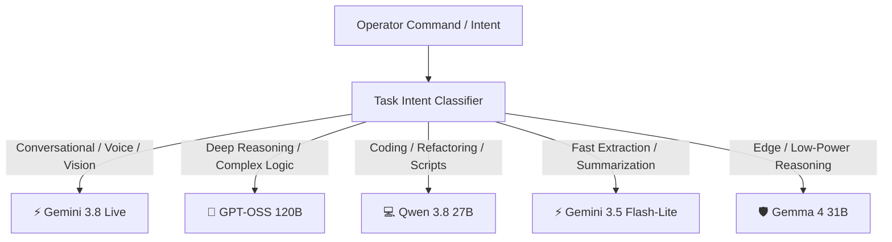
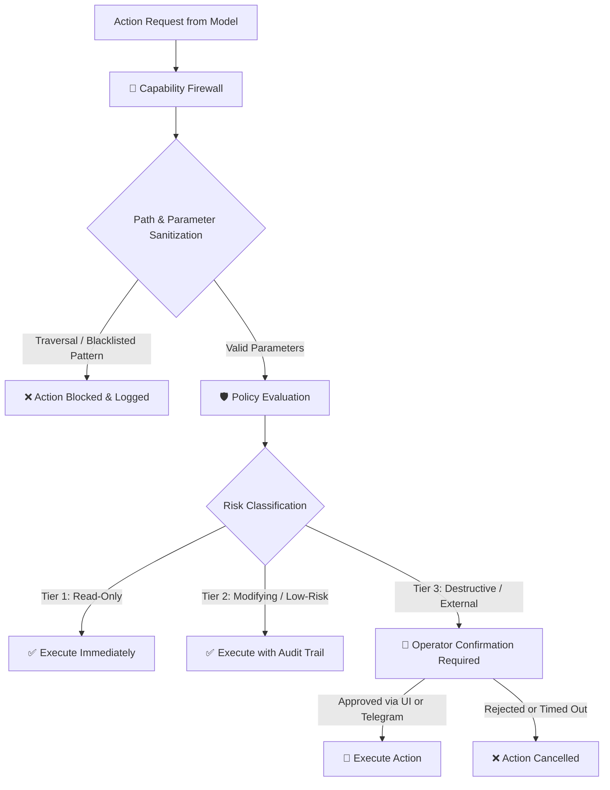

# 🏛️ JARVIS System Architecture Specification

**Status:** Authoritative Architectural Specification  
**Version:** 1.0.0  
**Target Operating System:** Microsoft Windows 10 / 11 (64-bit)  
**Primary Interaction Engine:** Gemini 3.8 Live Multimodal API (Audio / Text / Vision)  
**Execution Substrates:** Python Control Plane + Node.js Automation Substrate + Native Windows COM UIA  

---

## 📑 Table of Contents

1. [Executive Blueprint & Operating Philosophy](#1-executive-blueprint--operating-philosophy)
2. [End-to-End System Architecture Blueprint](#2-end-to-end-system-architecture-blueprint)
3. [Cognitive Core & Realtime Multimodal Interaction](#3-cognitive-core--realtime-multimodal-interaction)
4. [Audio Subsystem & Hardware-Isolated AEC Engine](#4-audio-subsystem--hardware-isolated-aec-engine)
5. [Multi-Provider Windows & Application Automation Fabric](#5-multi-provider-windows--application-automation-fabric)
6. [Autonomous WhatsApp Voice Telephony Subsystem](#6-autonomous-whatsapp-voice-telephony-subsystem)
7. [Native Telegram Remote Control Architecture](#7-native-telegram-remote-control-architecture)
8. [Execution Substrate & IPC Engine](#8-execution-substrate--ipc-engine)
9. [Gateway Daemon & Neural Web Interface](#9-gateway-daemon--neural-web-interface)
10. [Multi-Model Router & Cognitive Delegation](#10-multi-model-router--cognitive-delegation)
11. [Memory Fabric & Standing Intent Engine](#11-memory-fabric--standing-intent-engine)
12. [Capability Security, Firewall & Policy Hierarchy](#12-capability-security-firewall--policy-hierarchy)
13. [Core Engineering Invariants & Quality Verification](#13-core-engineering-invariants--quality-verification)

---

## 1. Executive Blueprint & Operating Philosophy

**JARVIS** is an autonomous personal AI operating system engineered from the ground up for deep Microsoft Windows integration, real-time voice and vision conversation, and closed-loop task execution.

Unlike superficial chat overlays or browser-wrapped assistants, JARVIS functions as an operating-system-level cognitive control plane:

```text
┌────────────────────────────────────────────────────────────────────────┐
│                        OPERATOR (Voice / Vision / Input)               │
└───────────────────────────────────┬────────────────────────────────────┘
                                    │ Bidirectional PCM & Frames
                                    ▼
┌────────────────────────────────────────────────────────────────────────┐
│                        COGNITIVE MODEL (Gemini 3.8 Live)               │
│                  Proposes intents, tools, and spoken replies           │
└───────────────────────────────────┬────────────────────────────────────┘
                                    │ Proposed Action Invocations
                                    ▼
┌────────────────────────────────────────────────────────────────────────┐
│                   TRUST BOUNDARY: ACTION BROKER & FIREWALL             │
│      Evaluates policy, risk tiers, parameter sanitization & approvals  │
└───────────────────────────────────┬────────────────────────────────────┘
                                    │ Authorized Commands
                                    ▼
┌────────────────────────────────────────────────────────────────────────┐
│                   MULTI-PROVIDER EXECUTION FABRIC                      │
│        Windows COM UIA • Playwright CDP • WhatsApp VoIP • Substrate   │
└────────────────────────────────────────────────────────────────────────┘
```

### 1.1 Fundamental Architectural Axioms

1. **The Model is Never the Trust Boundary:** Large Language Models propose actions and synthesize responses; they do not possess authorization, execution privileges, raw credentials, or direct operating system handles. Every external side effect is evaluated by a local Capability Firewall and Policy Engine before execution.
2. **Closed-Loop Verification Over Speculation:** Actions are never considered complete upon dispatch. JARVIS interrogates native UI trees, DOM elements, or process states to confirm that the expected state change actually transpired.
3. **Hardware-Isolated Audio Capture:** Audio rendered by desktop applications (YouTube, Spotify, games, system alerts) is digitally captured via WASAPI Loopback and subtracted from the physical microphone stream before reaching speech recognition.
4. **Dual-Substrate Architecture:** A high-level Python kernel provides asynchronous event routing, memory indexing, and model orchestration, while a dedicated Node.js execution daemon provides high-speed sub-millisecond OS input simulation, CUA action handlers, and WebRTC telephony.
5. **Fail-Closed Remote Supervision:** Remote command interfaces (e.g. Telegram) operate over outbound-only encrypted long-polling with cryptographic pairing, ensuring zero inbound listening ports are exposed to public networks.

---

## 2. End-to-End System Architecture Blueprint

The following blueprint illustrates the complete end-to-end component topology of JARVIS across cognitive, audio, execution, and interface layers:


```mermaid
graph TD
    User(["👤 Operator: Voice / Vision / Input"]) <-->|Bidirectional Audio & Vision| GeminiLive["⚡ Gemini 3.8 Live API"]
    
    subgraph JARVIS_CORE ["JARVIS Control Plane & Kernel"]
        GeminiLive <-->|Tool Proposals & Audio| DialogueHost["🎙️ Live Dialogue Host"]
        DialogueHost <-->|Session State| ControlPlane["🧠 Cognitive Control Plane"]
        ControlPlane <-->|Intent & Routing| ModelRouter["🔀 Multi-Model Router"]
        ControlPlane <-->|Tool Dispatch| ActionBroker["🛡️ Action Broker & Capability Firewall"]
        ControlPlane <-->|Context & FTS5| MemoryFabric[("💾 Memory & Session Fabric")]
        ControlPlane <-->|Cron Pulses| CronScheduler["⏱️ Background Cron Daemon"]
        Gateway["🌐 Gateway WebSocket Daemon (ws://127.0.0.1:8765)"] <--> ControlPlane
    end

    subgraph AUDIO_PIPELINE ["Audio & DSP Subsystem"]
        Microphone(["🎤 Physical Mic"]) --> PrimaryStream["Primary Capture d(n)"]
        Speakers(["🔊 Speakers / Soundcard"]) --> WASAPILoopback["WASAPI Loopback Ref x(n)"]
        PrimaryStream --> AEC["🎛️ PBFDAF Echo Canceller & Coherence Mask"]
        WASAPILoopback --> AEC
        AEC --> CleanMic["Clean 16kHz PCM Stream"] --> GeminiLive
        SpeakersTracker["⏱️ Playback Activity Tracker"] -.->|Barge-in Gate| DialogueHost
    end

    subgraph EXECUTION_FABRIC ["Multi-Provider Execution Fabric"]
        ActionBroker --> AppControl["🖥️ Universal App Control Engine"]
        AppControl -->|Tier 1| NativeURI["⚡ Native URI / CLI Protocol"]
        AppControl -->|Tier 2| COM_UIA["🪟 Windows COM UI Automation"]
        AppControl -->|Tier 3| BrowserNode["🌐 Playwright Browser Node"]
        AppControl -->|Tier 4| SubstrateBridge["🔌 Substrate IPC Bridge"]
        
        SubstrateBridge <-->|JSON-RPC 2.0 stdio| SubstrateRunner["⚡ Node.js Substrate Runner"]
        SubstrateRunner --> CoordinateCUA["🖱️ Coordinate & Visual Automation"]
    end

    subgraph TELEPHONY_NODE ["Autonomous WhatsApp Telephony"]
        ActionBroker --> WANode["📞 WhatsApp Node"]
        WANode --> TelephonyRunner["📱 WebRTC Audio Bridge & Baileys"]
        TelephonyRunner <-->|Full-Duplex VoIP| GeminiLive
        TelephonyRunner --> CallHistory[("📜 call-history.json")]
    end

    subgraph REMOTE_NODE ["Native Telegram Remote Daemon"]
        TGBot["🤖 Telegram Daemon (aiogram 3.x)"] <-->|Dedicated Live Session| TGLive["⚡ Telegram Live Engine"]
        TGLive --> ActionBroker
        TGBot --> Approvals["🔐 Inline Operator Approvals"]
    end

    subgraph FRONTEND_LAYER ["Neural Web Interface (http://127.0.0.1:8080)"]
        Gateway <--> UIClient["💻 Gateway Client (client.js)"]
        UIClient --> SignalOrb["🔮 Signal Orb (WebGL Fibonacci)"]
        UIClient --> SpeakingOrb["🗣️ Speaking Orb (Particle Typography)"]
        UIClient --> AudioPlayer["🔊 Web Audio 24kHz PCM Player"]
    end
```

---

## 3. Cognitive Core & Realtime Multimodal Interaction

The cognitive core is driven by the **Gemini 3.8 Live API** (`src/jarvis/cognition/gemini_live.py`) via bidirectional WebSockets. This engine delivers sub-second conversational latency, full-duplex speech, real-time desktop vision, and native tool execution.

### 3.1 Bidirectional Streaming Flow
- **Audio Uplink:** Continuous 16kHz 16-bit linear PCM audio chunked into 100ms frames and transmitted over the WebSocket.
- **Audio Downlink:** 24kHz 16-bit linear PCM audio streamed from Gemini and dispatched to the Web Audio player or hardware playback devices.
- **Vision Ingestion:** High-resolution desktop snapshots encoded as JPEG frames and interleaved into the WebSocket session on-demand or following tool actions.
- **Barge-In Handling:** When the operator begins speaking while JARVIS is responding, an interruption signal is emitted immediately. Audio buffers are flushed on the host and in the Neural UI, resetting the voice engine to active listening within milliseconds.

### 3.2 Tool Calling & Completion Lifecycle
When Gemini 3.8 Live determines an action is required, it yields a `tool_call` frame containing the function name and structured arguments:


```mermaid
sequenceDiagram
    autonumber
    participant GEM as "⚡ Gemini 3.8 Live"
    participant BRG as "🌉 Gemini Live Bridge"
    participant GW as "🌐 Gateway Server"
    participant AB as "🛡️ Action Broker"
    participant UI as "💻 Neural Web UI"

    GEM->>BRG: tool_call (name, args)
    BRG->>GW: broadcast live.tool_call (name, args)
    GW->>UI: setInterfaceMode('searching', detail)
    BRG->>AB: execute action request
    AB->>AB: policy check & execution
    AB-->>BRG: return action result
    BRG->>GW: broadcast live.tool_complete (name, result)
    GW->>UI: setInterfaceMode('done', detail)
    BRG->>GEM: send_tool_response (function_responses)
    GEM-->>BRG: resume spoken response (live.audio)
    BRG->>GW: broadcast live.audio
    GW->>UI: setInterfaceMode('speaking')
```

---

## 4. Audio Subsystem & Hardware-Isolated AEC Engine

Desktop voice assistants frequently suffer from **acoustic echo contamination**: sound played through speakers (media playback, games, or the assistant's own voice) enters the physical microphone, triggering false wakeups and conversational loops.

JARVIS resolves this at the digital signal processing layer through a **hardware loopback reference subtraction pipeline** (`src/jarvis/voice/audio_aec.py`):


```mermaid
sequenceDiagram
    autonumber
    participant SPK as "🔊 Sound Card (Render)"
    participant LB as "🔄 WASAPI Loopback Worker"
    participant MIC as "🎤 Physical Microphone"
    participant DSP as "🎛️ PBFDAF Engine"
    participant DTD as "📊 Double-Talk Detector"
    participant MSC as "🔬 Coherence Suppressor"
    participant GEM as "⚡ Gemini 3.8 Live"

    SPK->>LB: Capture pure digital reference x(n)
    SPK-->>MIC: Acoustic room reverberation y(n)
    User->>MIC: User voice s(n)
    MIC->>DSP: Combined input d(n) = s(n) + y(n)
    LB->>DSP: Send reference block x(n)
    DSP->>DTD: Compute cross-correlation & energy ratio
    alt Double-Talk Active (Operator Speaking)
        DTD->>DSP: Freeze filter weight updates (preserve voice)
    else Echo Only
        DTD->>DSP: Adapt filter weights W(f) via NLMS
    end
    DSP->>MSC: Error signal e(n) = d(n) - y_hat(n)
    MSC->>MSC: Compute Magnitude Squared Coherence mask
    MSC->>GEM: Stream clean microphone PCM (16kHz mono)
```

### 4.1 DSP Architecture Details
1. **WASAPI Digital Loopback:** Captures pure digital reference samples $x(n)$ directly from the Windows audio render device before digital-to-analog conversion.
2. **Partitioned Block Frequency Domain Adaptive Filter (PBFDAF):** Divides the acoustic impulse response into uniform sub-blocks. Implements regularized Normalized Least Mean Squares (NLMS) adaptation in the frequency domain with low algorithmic latency.
3. **Normalized Double-Talk Detector (DTD):** Continuously monitors the cross-correlation and energy ratios between microphone input and render reference. When operator speech is detected during speaker output, filter adaptation is immediately frozen to prevent weight corruption.
4. **Magnitude Squared Coherence (MSC) Spectral Mask:** A post-filter computes the coherence across spectral bins, attenuating residual non-linear distortion and acoustic room reverberations.

---

## 5. Multi-Provider Windows & Application Automation Fabric

JARVIS avoids fragile coordinate-based clicking by operating through a **multi-tier closed-loop decision hierarchy** (`src/jarvis/execution/windows/`):


```mermaid
flowchart TD
    Req(["Action: Click 'Log in' on WhatsApp"]) --> ResolveWin["Find Target Window Handle"]
    ResolveWin --> FocusWin["Focus & Restore Window"]
    FocusWin --> ProviderCheck{"Select Execution Provider"}
    
    ProviderCheck -->|URI / CLI available| Tier1["Tier 1: Native Application Protocol"]
    ProviderCheck -->|Desktop Application| Tier2["Tier 2: Microsoft COM UI Automation"]
    ProviderCheck -->|Web Page / CDP| Tier3["Tier 3: Playwright DOM Inspector"]
    ProviderCheck -->|Canvas / Game / Fallback| Tier4["Tier 4: Substrate CUA Coordinate Fallback"]
    
    Tier2 --> FindElem["Find UIElement via ControlViewWalker"]
    FindElem --> TryPattern{"Supported Pattern?"}
    TryPattern -->|InvokePattern| DoInvoke["Execute Invoke"]
    TryPattern -->|ValuePattern| DoValue["Execute SetValue"]
    TryPattern -->|TogglePattern| DoToggle["Execute Toggle"]
    TryPattern -->|Unsupported / Protected| FallbackCoord["Calculate Bounding Box Center"]
    
    FallbackCoord --> SubstrateClick["Substrate mouse_click (x, y)"]
    
    DoInvoke --> Settle["Wait Settling Delay (200ms)"]
    DoValue --> Settle
    DoToggle --> Settle
    SubstrateClick --> Settle
    
    Settle --> VerifyState{"Re-query UI State"}
    VerifyState -->|State Confirmed| Success(["✅ Action Verified & Confirmed"])
    VerifyState -->|State Unchanged| Downgrade["Transition Down Provider Hierarchy"]
    Downgrade --> Tier4
```

### 5.1 Provider Hierarchy Breakdown
- **Tier 1 (Native Protocols):** Direct application invocation via registered Windows URI schemes (e.g. `spotify:`, `mailto:`) or programmatic CLI parameters.
- **Tier 2 (Microsoft COM UI Automation):** Communicates out-of-process with `UIAutomationCore.dll`. Discovers controls via `ControlViewWalker` and invokes native control patterns (`IUIAutomationInvokePattern`, `IUIAutomationValuePattern`, `IUIAutomationTogglePattern`) directly without moving the physical mouse.
- **Tier 3 (Playwright CDP Inspector):** For web browser contexts, leverages Chrome DevTools Protocol (CDP) to query accessibility trees, CSS/XPath selectors, and execute DOM interactions.
- **Tier 4 (Substrate Coordinate Automation):** High-precision OS mouse movement, clicks, and keystrokes dispatched through the Node.js execution substrate for uninstrumented custom canvas controls.

---

## 6. Autonomous WhatsApp Voice Telephony Subsystem

JARVIS incorporates an autonomous **WhatsApp VoIP Voice Telephony Subsystem** (`substrate/extensions/whatsapp/`) capable of placing outbound phone calls, conducting full-duplex conversations, and reporting structured outcomes back to the user:


```mermaid
flowchart LR
    JARVIS["🧠 JARVIS Kernel"] -->|whatsapp_call| WANode["📞 WhatsApp Node"]
    WANode -->|Spawn Runner| TSBridge["🔌 Telephony Substrate Bridge"]
    TSBridge --> WACall["📱 WhatsApp 1:1 Voice Call"]
    WACall <-->|Full-Duplex Audio| AudioBridge["🎛️ Realtime Audio Bridge"]
    AudioBridge <-->|Bidirectional PCM| GeminiLive["⚡ Gemini 3.8 Live"]
    
    WACall -->|Teardown| Debrief["📝 Grounded AI Debrief"]
    Debrief --> History[("💾 call-history.json")]
    Debrief --> Report["📦 Outcome & Reply"]
    Report --> JARVIS
```

### 6.1 Telephony Subsystem Highlights
- **Direct WebRTC Media Bridge:** Interfaces directly with WhatsApp Web VoIP signaling via Baileys and native WebRTC media streams, bypassing paid carrier trunks and Twilio fees.
- **Full-Duplex Conversational Audio:** Streams 16kHz PCM from the remote recipient into an isolated Gemini 3.8 Live session, delivering conversational turns with natural response latency.
- **Sub-Second Barge-In Detection:** Detects recipient speech energy during playback and instantly purges queued assistant audio frames to eliminate speech collisions.
- **Dual-Phase Farewell Gate:** Evaluates conversational farewells with a cancellable 4-second grace period. If the recipient speaks during the grace window, call termination aborts and dialogue continues.
- **Grounded AI Debrief:** Upon call termination, the complete raw conversation transcript is evaluated to extract factual outcomes, recorded in [`data/whatsapp/logs/call-history.json`](file:///data/whatsapp/logs/), and delivered to the operator.

---

## 7. Native Telegram Remote Control Architecture

JARVIS hosts a native **Telegram Remote Control Agent** (`src/jarvis/telegram/`) allowing the operator to command their PC remotely from any mobile device:


```mermaid
graph LR
    Phone(["📱 Phone / Telegram"]) <-->|Outbound Long Polling| HostBot["🤖 Telegram Daemon\n(aiogram 3.x)"]
    HostBot -->|Dedicated Live Session| TGLive["⚡ Gemini 3.8 Live Session"]
    TGLive -->|Tool Dispatch| Broker["🛡️ Action Broker & Firewall"]
    Broker --> Filesystem["📁 File Search & Delivery"]
    Broker --> WinHost["🖥️ Screenshot & Desktop Control"]
    Broker --> VoIP["📞 WhatsApp Telephony"]
    Filesystem -->|Direct File Upload| HostBot
    WinHost -->|Direct Photo Upload| HostBot
    Broker -.->|In-Place Updates| SingleCard["🎛️ Single Editable Status Card"]
    SingleCard -.->|HTML Edit| HostBot
```

### 7.1 Remote Daemon Features
- **Isolated Parallel Gemini Live Session:** Operates an independent Gemini 3.8 Live session with its own conversational context and tool definitions, leaving active desktop voice sessions undisturbed.
- **Fail-Closed Authorization:** Enforces strict whitelist verification. Unregistered Telegram user IDs are immediately dropped with access denial logs.
- **Cryptographic Pairing:** Pairing requires a 256-bit entropy challenge nonce generated locally (`jarvis telegram pair`) with a 5-minute time-to-live.
- **Single Editable Status Cards:** Status updates and long-running tasks edit a single message card in place, eliminating notification spam and complying with Telegram API rate limits.
- **Interactive Inline Approvals:** High-risk actions generate inline `[ ✅ AUTHORIZE ]` / `[ ❌ DENY ]` buttons with cryptographically signed tokens.
- **Direct Host File Delivery:** Locates and delivers files from the host filesystem directly to Telegram chat.

---

## 8. Execution Substrate & IPC Engine

To insulate the Python control plane from OS-level automation crashes, JARVIS pairs its kernel with a high-speed **Node.js Substrate Daemon** communicating over **JSON-RPC 2.0 stdio** (`src/jarvis/execution/substrate_bridge.py`):


```mermaid
flowchart LR
    subgraph Python_Kernel ["Python Control Plane"]
        Bridge["SubstrateBridge Singleton"]
        Reader["Async Stdout Reader Loop"]
        Pending["Pending Request Futures Map"]
    end

    subgraph Node_Substrate ["Node.js Substrate Daemon"]
        Runner["JarvisSubstrateRunner"]
        Driver["JarvisWindowsDriverSession"]
        CUA["CUA Computer Action Handlers"]
        Repair["Tool Call Repair Engine"]
    end

    Bridge -->|stdin: JSON-RPC 2.0 Request| Runner
    Runner --> Driver
    Driver --> CUA
    Driver --> Repair
    Runner -->|stdout: JSON-RPC 2.0 Result| Reader
    Reader --> Pending
```

---

## 9. Gateway Daemon & Neural Web Interface

The **JARVIS Gateway** (`src/jarvis/gateway/server.py`) operates an asynchronous WebSocket server on `ws://127.0.0.1:8765`, providing a typed pub/sub protocol for external frontends and system nodes:


```mermaid
sequenceDiagram
    autonumber
    participant Client as "🖥️ Neural Web UI"
    participant GW as "🌐 Gateway Server"
    participant CP as "🧠 Control Plane"
    participant DB as "💾 SQLite Session Store"

    GW-->>Client: connect.challenge (nonce)
    Client->>GW: connect req (client_id, session_id)
    GW->>Client: connect res (hello-ok, features)
    
    loop Realtime Events & Invocations
        Client->>GW: live.audio / live.text
        GW->>CP: cognitive conversational turn
        CP->>DB: record turn provenance & state
        CP-->>GW: broadcast live events
        GW-->>Client: live.tool_call / live.tool_complete / live.audio
    end
```

### 9.1 Neural Web UI Subsystem (`frontend/`)
The desktop Neural UI features dual procedural 3D WebGL spheres:
- **Signal Orb (`signal-orb.js`):** A 12,000-particle Fibonacci sphere that morphs across procedural modes:
  - `listening` (Warm Gold/Amber)
  - `thinking` (Violet/Purple)
  - `searching` (Cyan Orbiting Rings)
  - `done` (Mint-Green Checkmark Sphere)
- **Speaking Orb (`speaking-orb.js`):** A particle sphere with real-time typography flight. Words fly out from the sphere as spoken audio plays.
- **Monotonic Wall-Clock Synchronization:** Typography timing is locked to monotonic wall-clock elapsed time (`performance.now()`), preventing caption freezing or desynchronization when switching applications.
- **Document Visibility Synchronization:** `visibilitychange` and `focus` listeners instantly synchronize visual modes and drain states when the application window regains focus.

---

## 10. Multi-Model Router & Cognitive Delegation

JARVIS routes tasks dynamically across approved model families based on task classification, latency, token budgets, and capability requirements (`src/jarvis/cognition/model_router.py`):


```mermaid
flowchart TD
    Prompt["Operator Command / Intent"] --> Classifier["Task Intent Classifier"]
    
    Classifier -->|Conversational / Voice / Vision| M_Live["⚡ Gemini 3.8 Live"]
    Classifier -->|Deep Reasoning / Complex Logic| M_OSS["🧠 GPT-OSS 120B"]
    Classifier -->|Coding / Refactoring / Scripts| M_Qwen["💻 Qwen 3.8 27B"]
    Classifier -->|Fast Extraction / Summarization| M_Flash["⚡ Gemini 3.5 Flash-Lite"]
    Classifier -->|Edge / Low-Power Reasoning| M_Gemma["🛡️ Gemma 4 31B"]
```

---

## 11. Memory Fabric & Standing Intent Engine

JARVIS maintains persistent conversational state, learned preferences, and standing automation intents across sessions (`src/jarvis/memory/`):

- **Dual-Store Architecture:** Pairs SQLite WAL-mode transactional storage with an SQLite `FTS5` full-text search index.
- **Semantic Ranking with Recency Decay:** Ranks candidate memories using a composite score incorporating semantic query similarity, recency decay curves, and importance metrics.
- **Standing Intent Cron Engine (`cron_scheduler.py`):** Evaluates recurring conditions and standing intents on background pulses, dispatching tasks autonomously when triggers are satisfied.

---

## 12. Capability Security, Firewall & Policy Hierarchy

All actions must be vetted by the **Capability Firewall** (`src/jarvis/policy/firewall.py`) and **Policy Engine** (`src/jarvis/policy/engine.py`):


```mermaid
flowchart TD
    Action["Action Request from Model"] --> Firewall["🧱 Capability Firewall"]
    Firewall --> Sanitization{"Path & Parameter Sanitization"}
    Sanitization -->|Traversal / Blacklisted Pattern| Block["❌ Action Blocked & Logged"]
    Sanitization -->|Valid Parameters| Policy["🛡️ Policy Evaluation"]
    
    Policy --> Risk{"Risk Classification"}
    Risk -->|Tier 1: Read-Only| Allow["✅ Execute Immediately"]
    Risk -->|Tier 2: Modifying / Low-Risk| LogAllow["✅ Execute with Audit Trail"]
    Risk -->|Tier 3: Destructive / External| Gate["🔐 Operator Confirmation Required"]
    
    Gate -->|Approved via UI or Telegram| Execute["🚀 Execute Action"]
    Gate -->|Rejected or Timed Out| Abort["❌ Action Cancelled"]
```

---

## 13. Core Engineering Invariants & Quality Verification

All engineering modifications to JARVIS must strictly satisfy four core invariants:

1. **Top-Most Invariant (Never Hardcode Anything):** Dynamic configuration, discoverable endpoints, and OS-agnostic path handling (`pathlib.Path`).
2. **Strict Communication & Commit Standards:** Conventional Commits (`feat(...)`, `fix(...)`, etc.). Progress documented by functional capability. Absolute prohibition on the prohibited progression term.
3. **Data Safety & Privacy:** Private session records, keys, and `.env` files strictly gitignored.
4. **100% Quality Verification Gates:**
   - `pytest` passes with 100% success rate.
   - `mypy src tests` passes with 100% strict type safety.
   - `ruff check .` and `ruff format --check .` pass with zero violations.
