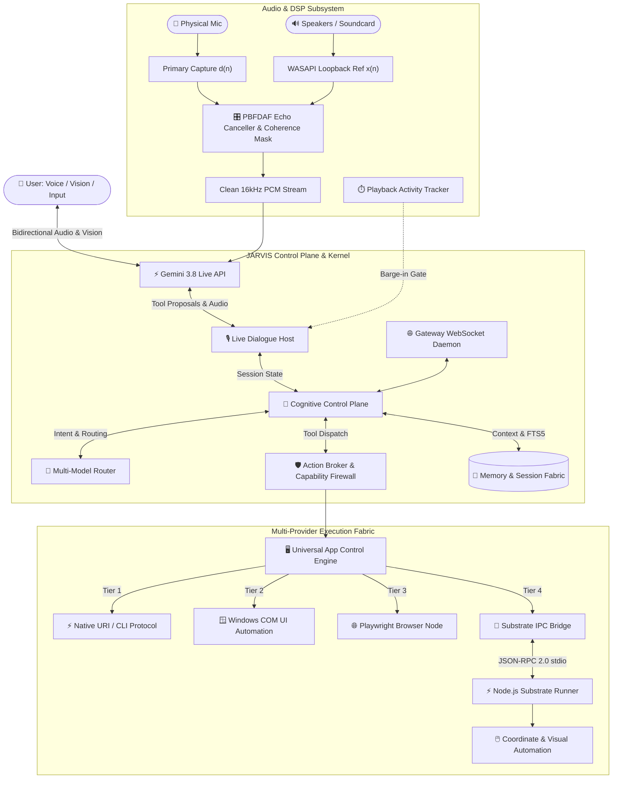
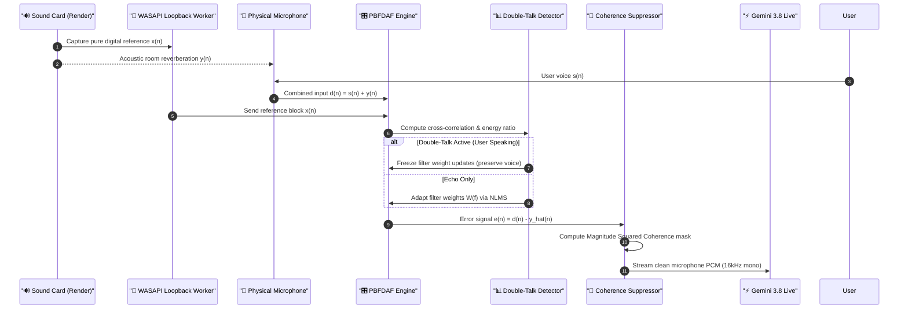
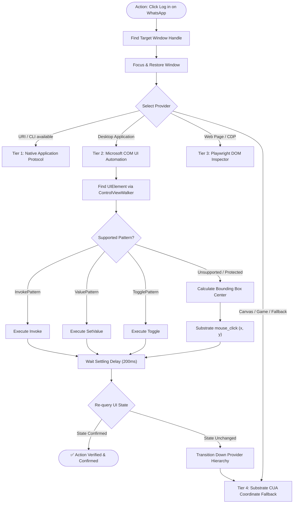
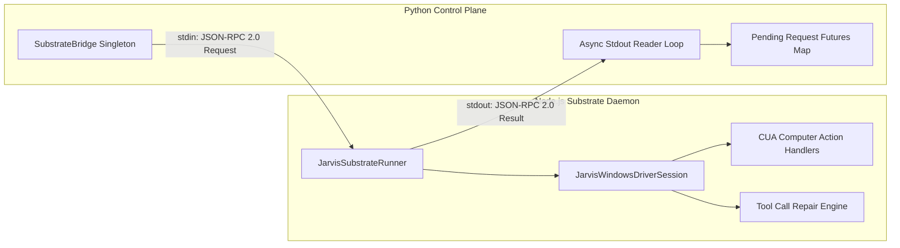
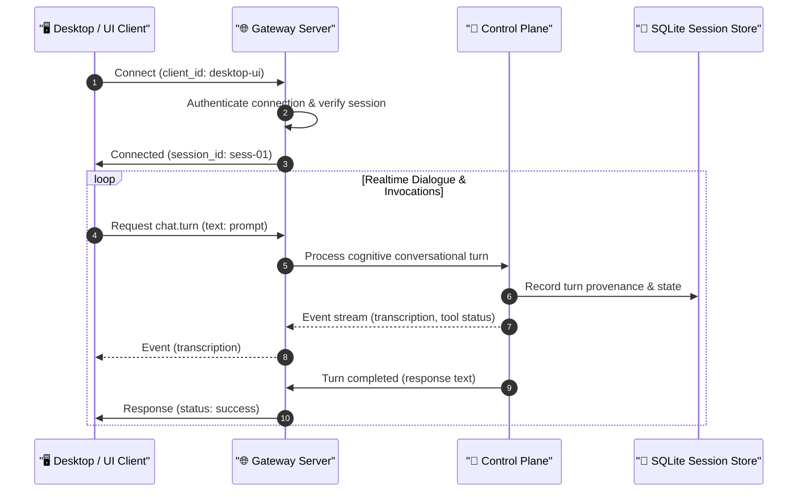

<div align="center">

# 🤖 JARVIS Personal AI Operating System

### *Stateful Multimodal Personal AI Operating System for Windows*

[](https://www.python.org/)
[](https://www.microsoft.com/windows)
[](https://ai.google.dev/)
[](https://nodejs.org/)
[](LICENSE)
[](https://mypy-lang.org/)
[](https://astral.sh/ruff)

<p align="center">
  <strong>Voice-First Realtime Cognition</strong> • 
  <strong>Hardware Acoustic Echo Cancellation</strong> • 
  <strong>Deep In-App Windows Automation</strong> • 
  <strong>Multi-Agent Control Plane</strong>
</p>

</div>

---

## 📑 Table of Contents

- [1. Executive Summary](#1-executive-summary)
- [2. System Architecture](#2-system-architecture)
- [3. Audio & Acoustic Echo Cancellation (AEC)](#3-audio--acoustic-echo-cancellation-aec)
- [4. Deep In-App & Windows Automation](#4-deep-in-app--windows-automation)
- [5. Execution Substrate & IPC Engine](#5-execution-substrate--ipc-engine)
- [6. Gateway Protocol & Control Plane](#6-gateway-protocol--control-plane)
- [7. Core Capabilities Matrix](#7-core-capabilities-matrix)
- [8. Installation & Setup Guide](#8-installation--setup-guide)
- [9. Quickstart & Usage](#9-quickstart--usage)
- [10. Quality Gates & Verification](#10-quality-gates--verification)
- [11. Core Architectural Invariants](#11-core-architectural-invariants)

---

## 1. Executive Summary

**JARVIS** is an autonomous personal AI operating system engineered from the ground up for deep Microsoft Windows integration, real-time voice and vision conversation, and closed-loop task execution.

Unlike superficial chat overlays, JARVIS operates as an operating-system-level cognitive control plane:
- **Speaks and Listens Naturally:** Direct bidirectional voice and vision streaming via the **Gemini 3.8 Live API** over low-latency WebSockets.
- **Hardware-Isolated Audio Capture:** Dedicated DSP engine with real-time **WASAPI loopback reference capture** that completely subtracts speaker output, YouTube playback, music, and system sounds from the microphone input.
- **Deep Windows UI Automation:** Out-of-process COM integration with Microsoft UI Automation (`UIAutomationCore.dll`) invoking native control patterns (`Invoke`, `Value`, `Toggle`, `Selection`, `Scroll`) without pixel guessing or mouse hijacking.
- **Resilient Multi-Provider Hierarchy:** Seamless progression from Programmatic URI schemes to COM UI Automation, Playwright browser DOM inspection, and coordinate CUA fallbacks.
- **Model-Independent Trust Boundary:** Models propose actions; local capability firewalls evaluate policy, risk, and user authorization before side effects occur.

---

## 2. System Architecture

The following diagram illustrates the complete end-to-end cognitive and execution flow of JARVIS:



---

## 3. Audio & Acoustic Echo Cancellation (AEC)

A major challenge in desktop voice assistants is **audio contamination**: sound played through speakers (e.g. YouTube videos, music, games, system sounds, or the assistant's own speech) re-enters the microphone.

JARVIS solves this at the DSP level using a real-time **hardware reference subtraction pipeline**:



- **WASAPI Digital Loopback:** Pure digital capture of speaker output before DAC conversion.
- **Partitioned Block Frequency Domain Adaptive Filter (PBFDAF):** Low-latency sub-band adaptive filtering with regularized NLMS adaptation.
- **Normalized Double-Talk Detection (DTD):** Freezes filter adaptation during user speech to prevent filter divergence.
- **Magnitude Squared Coherence (MSC):** Suppresses non-linear acoustic room harmonics and residual echo.

---

## 4. Deep In-App & Windows Automation

JARVIS does not rely on fragile coordinate clicks. It operates through a **closed-loop state verification hierarchy**:



---

## 5. Execution Substrate & IPC Engine

To ensure stability and isolate computer automation, JARVIS pairs its Python cognitive kernel with a high-speed **Node.js execution runner** communicating over bidirectional **JSON-RPC 2.0 stdio**:



---

## 6. Gateway Protocol & Control Plane

The Gateway daemon operates a central WebSocket hub (`ws://127.0.0.1:8765`) enabling external frontends, voice companion widgets, and background daemons to communicate with the JARVIS kernel:



---

## 7. Core Capabilities Matrix

| Domain | Capability | Technical Provider / Subsystem |
| :--- | :--- | :--- |
| **Realtime Voice** | Bidirectional low-latency speech & barge-in | Gemini 3.8 Live API (`gemini_live.py`) |
| **Audio Isolation** | Render loopback reference cancellation | WASAPI DSP Adaptive Filter (`audio_aec.py`) |
| **Vision & Screen** | Full desktop & window visual perception | Screen Snapshot Pipeline & Gemini Live Vision |
| **UI Automation** | Control-pattern in-app manipulation | Microsoft COM UI Automation (`UIAutomationCore.dll`) |
| **Coordinate Fallback** | Sub-pixel mouse & keyboard simulation | Native Execution Substrate (`jarvis_substrate_runner.ts`) |
| **Browser Control** | Headless & headed DOM automation | Playwright CDP Subsystem (`browser/session.py`) |
| **Multi-Model Routing** | Intent-driven cognitive model selection | Model Router (Gemini Live, GPT-OSS, Qwen, Gemma) |
| **Memory & Intent** | Full-text memory search & standing intents | SQLite FTS5 + Background Cron Scheduler |
| **Capability Security** | Safe side-effect governance & policy | Policy Engine & Capability Firewall |

---

## 8. Installation & Setup Guide

### 8.1 System Prerequisites

- **Operating System:** Windows 10 or Windows 11 (64-bit)
- **Python:** Python 3.10 or higher
- **Node.js:** Node.js 18.0.0 or higher (with `npm` and `npx`)
- **Git:** Git for Windows
- **Audio Device:** Physical microphone and speakers or headphones

### 8.2 Clone the Repository

```bash
git clone https://github.com/deepakrakshit/jarvis-ai.git
cd jarvis-ai
```

### 8.3 Set Up Python Environment

Create a dedicated virtual environment and install the required dependencies:

```bash
# Create virtual environment
python -m venv .venv

# Activate virtual environment
.venv\Scripts\activate

# Install project and development dependencies
pip install -e ".[dev]"
```

### 8.4 Configure Environment Variables

A documented template is provided in [`.env.example`](file:///.env.example). Create your local `.env` configuration file in the project root:

```bash
copy .env.example .env
```

Open `.env` and fill in your desired parameters and API credentials:

```ini
# ==============================================================================
# 1. API Credentials & Authentication
# ==============================================================================
# Google Gemini API Key (Required for Live Audio & Multimodal Cognition)
GEMINI_API_KEY=your_gemini_api_key_here

# Groq API Key (Optional for ultra-fast text model routing and fallback inference)
GROQ_API_KEY=your_groq_api_key_here

# ==============================================================================
# 2. Audio Capture & Hardware Pipeline Settings
# ==============================================================================
# Audio input device index (leave blank for automatic Windows default communication device)
AUDIO_INPUT_DEVICE_INDEX=
AUDIO_INPUT_SAMPLE_RATE=16000
AUDIO_INPUT_CHANNELS=1
AUDIO_OUTPUT_SAMPLE_RATE=24000
AUDIO_VAD_ENERGY_THRESHOLD=15.0
VOICE_DRAIN_HOLD_MS=250

# ==============================================================================
# 3. Acoustic Echo Cancellation (AEC) & DSP Pipeline
# ==============================================================================
AUDIO_AEC_ENABLED=true
AUDIO_AEC_PARTITIONS=6
AUDIO_AEC_STEP_SIZE=0.25
AUDIO_AEC_SUPPRESSION_DB=30.0
AUDIO_AEC_DELAY_MAX_MS=250

# ==============================================================================
# 4. Gateway Daemon & Network Server
# ==============================================================================
GATEWAY_HOST=127.0.0.1
GATEWAY_PORT=8765
GATEWAY_PORT_AUTO_DISCOVERY=true
GATEWAY_PORT_SEARCH_LIMIT=50
```

---

## 9. Quickstart & Usage

### 9.1 One-Click Launcher (`run.bat`)

Double-click `run.bat` or run it from command prompt:

```cmd
run.bat
```

This automatically activates `.venv`, boots the background Gateway daemon on `ws://127.0.0.1:8765`, initializes the audio AEC pipeline, and starts an interactive live voice session.

### 9.2 Command-Line Interface (CLI)

```bash
# Boot live conversational session with daemon
python -m jarvis.cli chat --live --with-daemon

# Run background gateway server only
python -m jarvis.cli gateway --host 127.0.0.1 --port 8765

# Perform system health check and dependency diagnostics
python -m jarvis.cli doctor

# Send a single autonomous instruction
python -m jarvis.cli run "Open Notepad and type Hello World"
```

---

## 10. Quality Gates & Verification

JARVIS maintains strict engineering quality gates enforced via automated test runners:

```bash
# Run complete test suite (132 test cases)
pytest

# Enforce strict static type checking
python -m mypy src tests

# Verify clean formatting and linting
python -m ruff check .
python -m ruff format --check .
```

---

## 11. Core Architectural Invariants

1. **Zero Hardcoding Invariant:** Configurations, filesystem paths, credentials, and models are dynamically resolved at runtime via environment variables and settings schemas.
2. **Model Is Not the Trust Boundary:** Cognitive models propose actions, but local validation, policy rules, and permission checks determine execution safety.
3. **Data Safety & Privacy:** Private user credentials (`.env`), session files (`sessions.json`, `conversations.json`), and database stores (`*.db`, `*.sqlite`) are strictly gitignored.
4. **Deterministic Closed-Loop Execution:** All desktop interactions execute via Observe $\rightarrow$ Act $\rightarrow$ Verify to guarantee state confirmation.

---

<div align="center">
  <p><strong>JARVIS Personal AI Operating System</strong> • Built for the next era of personal computing.</p>
</div>
