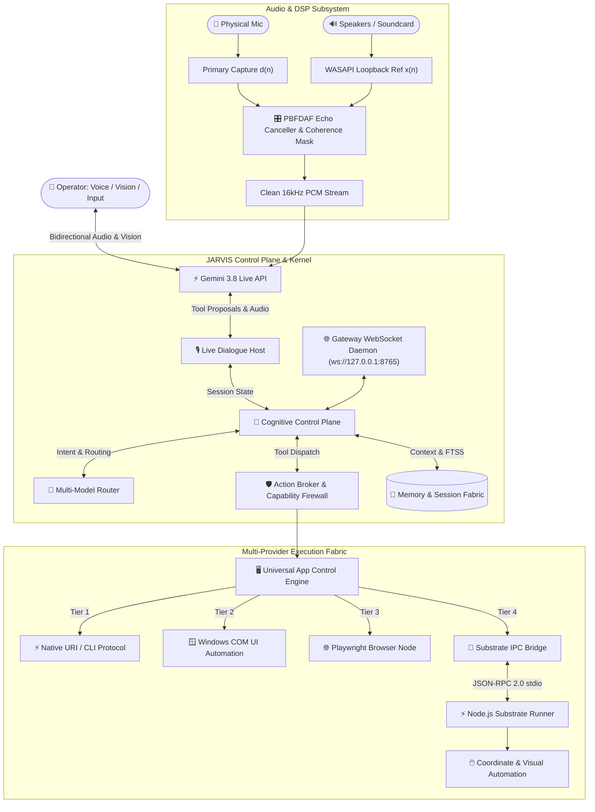

<div align="center">

# 🤖 JARVIS Personal AI Operating System

### *Stateful Multimodal Personal AI Operating System for Windows*

[](https://www.python.org/)
[](https://www.microsoft.com/windows)
[](https://ai.google.dev/)
[](https://nodejs.org/)
[](docs/WHATSAPP_VOICE_TELEPHONY.md)
[](docs/TELEGRAM_REMOTE_CONTROL.md)
[](LICENSE)
[](https://mypy-lang.org/)
[](https://astral.sh/ruff)
[](CONTRIBUTING.md)
[](https://github.com/deepakrakshit/jarvis-ai/issues?q=is%3Aissue+is%3Aopen+label%3A%22good+first+issue%22)

<p align="center">
  <strong>Voice-First Realtime Cognition</strong> • 
  <strong>Hardware Acoustic Echo Cancellation</strong> • 
  <strong>Deep In-App Windows Automation</strong> • 
  <strong>Autonomous WhatsApp Telephony</strong> • 
  <strong>Native Telegram Remote Control</strong> • 
  <strong>Multi-Agent Control Plane</strong>
</p>

</div>

---

## 🤝 Looking for Contributors

**JARVIS is actively looking for developers interested in AI agents, Windows automation, realtime voice, UI, memory, integrations, testing, and infrastructure.**

You don't need to understand the whole codebase to make a meaningful impact:
* 🟢 **New to the project?** Start with a **[Good First Issue](https://github.com/deepakrakshit/jarvis-ai/issues?q=is%3Aissue+is%3Aopen+label%3A%22good+first+issue%22)** &mdash; curated bite-sized tasks perfect for getting started.
* 🙋 **Have domain expertise?** Check out **[Help Wanted](https://github.com/deepakrakshit/jarvis-ai/issues?q=is%3Aissue+is%3Aopen+label%3A%22help+wanted%22)** issues needing specialized focus (DSP audio, WebRTC, UIA, WebGL, memory).
* 🛠️ **Contributor Guide:** Follow our step-by-step **[Contributing Guide](CONTRIBUTING.md)** for local Windows dev setup, quality verification gates, and PR hygiene.
* 🗺️ **Strategic Roadmap:** Explore **[ROADMAP.md](ROADMAP.md)** to see current horizons and ongoing initiatives.
* 💬 **Discussions & Ideas:** Join the conversation in **[GitHub Discussions](https://github.com/deepakrakshit/jarvis-ai/discussions)** or file an **[Issue](https://github.com/deepakrakshit/jarvis-ai/issues)**.

---

## 📑 Table of Contents

- [Looking for Contributors](#-looking-for-contributors)
- [Overview](#-overview)
- [System Architecture](#-system-architecture)
- [Core Capabilities](#-core-capabilities)
- [Documentation Hub](#-documentation-hub)
- [Quickstart & Installation](#-quickstart--installation)
- [Usage & Interactive Modes](#-usage--interactive-modes)
- [Quality Verification Gates](#-quality-verification-gates)
- [Contributing & Community](#-contributing--community)
- [Core Engineering Invariants](#-core-engineering-invariants)
- [License](#-license)

---

## 🌟 Overview

**JARVIS** is an autonomous personal AI operating system engineered for deep Microsoft Windows integration, natural full-duplex voice and vision conversation, and closed-loop task execution.

Unlike superficial chat overlays, JARVIS functions as an operating-system-level cognitive control plane:

* **Speaks and Listens Naturally:** Direct bidirectional voice and vision streaming via the **Gemini 3.8 Live API** over low-latency WebSockets.
* **Hardware-Isolated Audio Capture:** Dedicated DSP engine with real-time **WASAPI loopback reference capture** that completely subtracts speaker output, YouTube playback, music, and system sounds from the microphone input.
* **Deep Windows UI Automation:** Out-of-process COM integration with Microsoft UI Automation (`UIAutomationCore.dll`) invoking native control patterns (`Invoke`, `Value`, `Toggle`, `Selection`, `Scroll`) without pixel guessing or mouse hijacking.
* **Autonomous WhatsApp VoIP Telephony:** Places full-duplex outbound voice calls over WhatsApp to deliver messages, question recipients, or conduct goal-oriented dialogues using a low-latency WebRTC and Gemini Live audio bridge with real-time barge-in and conversational memory.
* **Native Telegram Remote Control:** Supervise, inspect, and command your PC remotely from any smartphone with dedicated parallel Gemini Live sessions, fail-closed authorization, and direct file delivery.
* **Model-Independent Trust Boundary:** Models propose actions; local capability firewalls evaluate policy, risk, and user authorization before side effects occur.

---

## 🏛️ System Architecture

JARVIS pairs a high-level Python cognitive orchestrator with a high-speed Node.js execution substrate:


```mermaid
graph TD
    Operator(["👤 Operator: Voice / Vision / Input"]) <-->|Bidirectional Audio & Vision| GeminiLive["⚡ Gemini 3.8 Live API"]
    
    subgraph JARVIS_CORE ["JARVIS Control Plane & Kernel"]
        GeminiLive <-->|Tool Proposals & Audio| DialogueHost["🎙️ Live Dialogue Host"]
        DialogueHost <-->|Session State| ControlPlane["🧠 Cognitive Control Plane"]
        ControlPlane <-->|Intent & Routing| ModelRouter["🔀 Multi-Model Router"]
        ControlPlane <-->|Tool Dispatch| ActionBroker["🛡️ Action Broker & Capability Firewall"]
        ControlPlane <-->|Context & FTS5| MemoryFabric[("💾 Memory & Session Fabric")]
        Gateway["🌐 Gateway WebSocket Daemon (ws://127.0.0.1:8765)"] <--> ControlPlane
    end

    subgraph AUDIO_PIPELINE ["Audio & DSP Subsystem"]
        Microphone(["🎤 Physical Mic"]) --> PrimaryStream["Primary Capture d(n)"]
        Speakers(["🔊 Speakers / Soundcard"]) --> WASAPILoopback["WASAPI Loopback Ref x(n)"]
        PrimaryStream --> AEC["🎛️ PBFDAF Echo Canceller & Coherence Mask"]
        WASAPILoopback --> AEC
        AEC --> CleanMic["Clean 16kHz PCM Stream"] --> GeminiLive
    end

    subgraph EXECUTION_FABRIC ["Multi-Provider Execution Fabric"]
        ActionBroker --> AppControl["🖥️ Universal App Control Engine"]
        AppControl -->|Tier 1| NativeURI["⚡ Native URI / CLI Protocol"]
        AppControl -->|Tier 2| COM_UIA["🪟 Windows COM UI Automation"]
        AppControl -->|Tier 3| BrowserNode["🌐 Playwright Browser Node"]
        AppControl -->|Tier 4| SubstrateBridge["🔌 Substrate IPC Bridge"]
        
        SubstrateBridge <-->|JSON-RPC 2.0 stdio| SubstrateRunner["⚡ Node.js Substrate Runner"]
        SubstrateRunner --> CoordinateCUA["🖱️ Coordinate & Visual Automation"]
    end
```

> [!NOTE]
> For complete end-to-end specifications, signal flow mathematics, and subsystem diagrams, see the **[JARVIS Architecture Specification](ARCHITECTURE.md)**.

---

## ⚡ Core Capabilities

| Domain | Capability | Technical Provider / Subsystem |
| :--- | :--- | :--- |
| **Realtime Voice** | Bidirectional low-latency speech & barge-in | Gemini 3.8 Live API (`gemini_live.py`) |
| **Audio Isolation** | Render loopback reference cancellation | WASAPI DSP Adaptive Filter (`audio_aec.py`) |
| **Autonomous Telephony** | Outbound 1:1 voice calling, barge-in & debriefing | WhatsApp VoIP Bridge (`substrate/extensions/whatsapp`) |
| **Remote Control** | Mobile smartphone remote supervision & approvals | Native Telegram Daemon (`telegram/service.py`) |
| **Vision & Screen** | Full desktop & window visual perception | Screen Snapshot Pipeline & Gemini Live Vision |
| **UI Automation** | Control-pattern in-app manipulation | Microsoft COM UI Automation (`UIAutomationCore.dll`) |
| **Coordinate Fallback** | Sub-pixel mouse & keyboard simulation | Native Execution Substrate (`jarvis_substrate_runner.ts`) |
| **Browser Control** | Headless & headed DOM automation | Playwright CDP Subsystem (`browser/session.py`) |
| **Multi-Model Routing** | Intent-driven cognitive model selection | Model Router (Gemini Live, GPT-OSS, Qwen, Gemma) |
| **Memory & Intent** | Full-text memory search & standing intents | SQLite FTS5 + Background Cron Scheduler |
| **Capability Security** | Safe side-effect governance & policy | Policy Engine & Capability Firewall |

---

## 📚 Documentation Hub

Explore detailed architectural manuals, contribution standards, and subsystem guides:

- **[System Architecture Specification](ARCHITECTURE.md):** Complete end-to-end architecture, signal processing equations, and subsystem blueprints.
- **[Development Roadmap](ROADMAP.md):** Long-term strategic horizons, milestones, and capability tracking.
- **[Contributing Guidelines](CONTRIBUTING.md):** Development environment setup, coding invariants, and pull request procedures.
- **[Security Policy](SECURITY.md):** Trust boundary model, capability firewall rules, and responsible vulnerability disclosure.
- **[Subsystem Manuals (`docs/`)](docs/):**
  - [Audio & AEC Subsystem](docs/AUDIO_AEC_SUBSYSTEM.md)
  - [Autonomous WhatsApp Voice Telephony](docs/WHATSAPP_VOICE_TELEPHONY.md)
  - [Native Telegram Remote Control](docs/TELEGRAM_REMOTE_CONTROL.md)
  - [Windows Application Control Engine](docs/APPLICATION_CONTROL_ENGINE.md)
  - [Gateway & Control Plane Protocol](docs/GATEWAY_AND_CONTROL_PLANE.md)
  - [Execution Substrate & IPC Engine](docs/EXECUTION_SUBSTRATE_IPC.md)

---

## 🚀 Quickstart & Installation

### 1. Prerequisites
- **Operating System:** Windows 10 or Windows 11 (64-bit)
- **Python:** Python 3.10 or higher
- **Node.js:** Node.js 18 LTS or higher
- **Browser:** Microsoft Edge or Google Chrome (for the dedicated Neural UI window)

### 2. Setup Environment
```powershell
# Clone the repository
git clone https://github.com/your-username/jarvis-workspace.git
cd jarvis-workspace

# Create and activate Python virtual environment
python -m venv .venv
.\.venv\Scripts\Activate.ps1

# Install Python package in editable mode
pip install -e ".[dev]"

# Install Substrate Node dependencies
cd substrate\extensions\whatsapp
npm install
npm run build
cd ..\..\..

# Configure environment variables
Copy-Item .env.example .env
```

Set your `GEMINI_API_KEY` in `.env`:
```ini
GEMINI_API_KEY="your-gemini-api-key-here"
```

---

## 🎮 Usage & Interactive Modes

### Start the Full Desktop Operating System
Launch JARVIS with the dedicated Neural 3D Web UI, WebSocket Gateway, and Live Multimodal Session:
```powershell
jarvis
```

### Command Line Interface
```powershell
# Interactive text chat mode
jarvis chat

# Pair a mobile device with the Telegram Remote Control Daemon
jarvis telegram pair

# Display system diagnostics and registered execution nodes
jarvis health
```

---

## 🧪 Quality Verification Gates

JARVIS enforces a non-negotiable 100% compliance gate for all code:

```powershell
# Run Python linter
ruff check .

# Verify code formatting
ruff format --check .

# Validate strict static type safety
mypy src tests

# Execute complete test suite
pytest
```

---

## 🤝 Contributing & Community

Contributions are what make open source an exceptional space to innovate, learn, and engineer. All contributions &mdash; whether bug reports, documentation clarifications, new test cases, or architectural enhancements &mdash; are warmly welcomed.

1. **Pick an issue:** Browse open **[Good First Issues](https://github.com/deepakrakshit/jarvis-ai/issues?q=is%3Aissue+is%3Aopen+label%3A%22good+first+issue%22)** or **[Help Wanted](https://github.com/deepakrakshit/jarvis-ai/issues?q=is%3Aissue+is%3Aopen+label%3A%22help+wanted%22)** topics.
2. **Follow development guidelines:** Check **[CONTRIBUTING.md](CONTRIBUTING.md)** for local Windows setup, commit conventions, and testing gates.
3. **Understand the architecture:** Explore **[ARCHITECTURE.md](ARCHITECTURE.md)** before touching core audio, UIA COM, or live WebSocket bridges.
4. **Adhere to community standards:** Review our **[Code of Conduct](CODE_OF_CONDUCT.md)** and **[Security Policy](SECURITY.md)**.

---

## 🏛️ Core Engineering Invariants

1. **Top-Most Invariant (Never Hardcode Anything):** All endpoints, paths, configurations, and models must be dynamic, discoverable, and parameterized.
2. **Strict Communication & Commit Standards:** Strictly follow Conventional Commits (`feat(...)`, `fix(...)`, etc.). Progress is documented by capability and domain.
3. **Data Safety & Privacy:** Private session records, keys, and `.env` files are strictly gitignored.
4. **100% Quality Gates:** Zero test failures, zero type errors, zero lint warnings.

---

## 📄 License

This project is licensed under the [MIT License](LICENSE).
