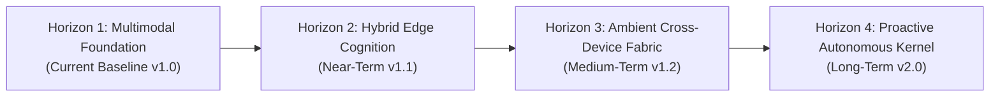

# 🗺️ JARVIS Development Roadmap

This document outlines the strategic evolution, architectural horizons, and capability milestones for the **JARVIS Personal AI Operating System**. Development is tracked by functional capabilities and architectural domains.

---

## 🧭 Architectural Horizons Overview

---

## 🌟 Horizon 1: Multimodal Foundation & Core OS (Current Baseline v1.0)

The foundational release establishes a robust, hardware-integrated desktop operating system control plane:

- [x] **Realtime Multimodal Cognition:** Bidirectional 16kHz PCM streaming and vision ingestion over WebSockets via Gemini 3.8 Live API.
- [x] **Hardware Reference DSP Echo Cancellation:** WASAPI loopback reference capture with Partitioned Block Frequency Domain Adaptive Filtering (PBFDAF), Double-Talk Detection (DTD), and Magnitude Squared Coherence (MSC) suppression.
- [x] **Deep In-App Windows Automation:** Native COM UI Automation (`UIAutomationCore.dll`) control pattern traversal (`Invoke`, `Value`, `Toggle`, `Selection`, `Scroll`) without pixel guessing.
- [x] **Autonomous WhatsApp Telephony:** Full-duplex outbound voice calls via WebRTC audio bridge, sub-second barge-in detection, and grounded memory extraction.
- [x] **Native Telegram Remote Control:** Dedicated parallel Gemini 3.8 Live session, fail-closed authorizer, 256-bit cryptographic pairing, and single in-place status cards.
- [x] **High-Speed Execution Substrate:** Python kernel paired with Node.js execution daemon over bidirectional JSON-RPC 2.0 stdio.
- [x] **Neural 3D Web UI:** WebGL 3D Fibonacci Signal Orb, real-time particle typography Speaking Orb, monotonic typography clock, and visibility synchronization.
- [x] **Memory Fabric & Cron Daemon:** SQLite WAL + FTS5 full-text indexing, standing intent triggers, and background pulse monitoring.

---

## 🚀 Horizon 2: Local Hybrid Cognition & Edge Intelligence (Near-Term v1.1)

Focuses on edge efficiency, local pre-filtering, and expanded desktop resilience:

- [ ] **Local SLM Intent Pre-Filters:** Deploy high-efficiency local models (Gemma 4 2B / Qwen 2.5 3B) for sub-millisecond classification of offline commands (volume, media controls, app launching) without cloud latency.
- [ ] **WASM/ONNX Voice Activity Engine:** Hardware-accelerated local VAD (Silero / WebRTC VAD) in the DSP pipeline for ultra-low power idle monitoring.
- [ ] **Multi-Monitor Dynamic DPI Geometry:** Dynamic coordinate resolution, DPI scaling normalization, and multi-monitor window virtualization across mixed-resolution displays.
- [ ] **Intelligent Tool Call Repair Engine:** Automated schema correction and parameter inference for model proposals that miss optional attributes.
- [ ] **Offline Resilience Fallback:** Graceful degradation to local Ollama / llama.cpp models when internet connectivity drops.

---

## 🌐 Horizon 3: Ambient Cross-Device Fabric & Spatial Awareness (Medium-Term v1.2)

Expands JARVIS across physical rooms, workstations, and external applications:

- [ ] **Distributed Multi-Node Peer Mesh:** Secure peer-to-peer WebSocket mesh connecting secondary PCs, Raspberry Pi audio nodes, and home servers into a unified control plane.
- [ ] **Ambient Vision & Spatial Monitoring:** Background webcam and desktop video streams with low-framerate anomaly detection and operator proximity tracking.
- [ ] **Voice Biometric Identity Verification:** Speaker embedding extraction to verify operator voice signatures before executing high-privilege administrative actions.
- [ ] **Deep Application Extension Packs:** Dedicated native integration plugins for developer workflows (VS Code, JetBrains IDEs) and creative suites.
- [ ] **Interactive Visual Canvas:** Multi-turn collaborative visual whiteboard and artifact inspector directly within the Neural UI.

---

## 🔮 Horizon 4: Proactive Autonomous Kernel (Long-Term v2.0)

Autonomous self-evolution, containerized sandboxes, and proactive long-horizon task execution:

- [ ] **Self-Synthesizing Capabilities:** Autonomous generation, validation, and hot-loading of new execution skills from demonstrated operator workflows.
- [ ] **Micro-VM & Windows Sandbox Virtualization:** Disposable virtualized execution sandboxes for untrusted code execution and web explorations with zero host risk.
- [ ] **Proactive Goal Formulation:** Cognitive evaluation of standing goals and project deadlines, suggesting optimizations and preparing drafts ahead of user requests.
- [ ] **Distributed State Synchronization:** Encrypted multi-master session synchronization across personal mobile devices, laptops, and home servers.

---

## 📊 Capability Delivery Tracking

| Domain | Capability Milestone | Target Horizon | Status |
| :--- | :--- | :--- | :--- |
| **Voice & DSP** | PBFDAF WASAPI Loopback Echo Cancellation | Horizon 1 | Completed |
| **Voice & DSP** | Sub-Second Barge-In & Duplex Stream | Horizon 1 | Completed |
| **Voice & DSP** | Local ONNX VAD Acceleration | Horizon 2 | Planned |
| **Automation** | COM UI Automation Pattern Engine | Horizon 1 | Completed |
| **Automation** | Multi-Monitor Dynamic DPI Virtualization | Horizon 2 | In Progress |
| **Automation** | Micro-VM Disposable Execution Sandboxes | Horizon 4 | Conceptual |
| **Telephony** | WhatsApp VoIP WebRTC Outbound Telephony | Horizon 1 | Completed |
| **Remote Control**| Telegram Live Remote Session & Approvals | Horizon 1 | Completed |
| **Remote Control**| Multi-Node Distributed Peer Mesh | Horizon 3 | Planned |
| **Cognition** | Gemini 3.8 Live Bidirectional Bridge | Horizon 1 | Completed |
| **Cognition** | Multi-Model Routing (GPT-OSS, Qwen, Gemma)| Horizon 1 | Completed |
| **Cognition** | Local SLM Hybrid Intent Pre-Filter | Horizon 2 | In Design |
| **Cognition** | Self-Synthesizing Dynamic Skills | Horizon 4 | Conceptual |
