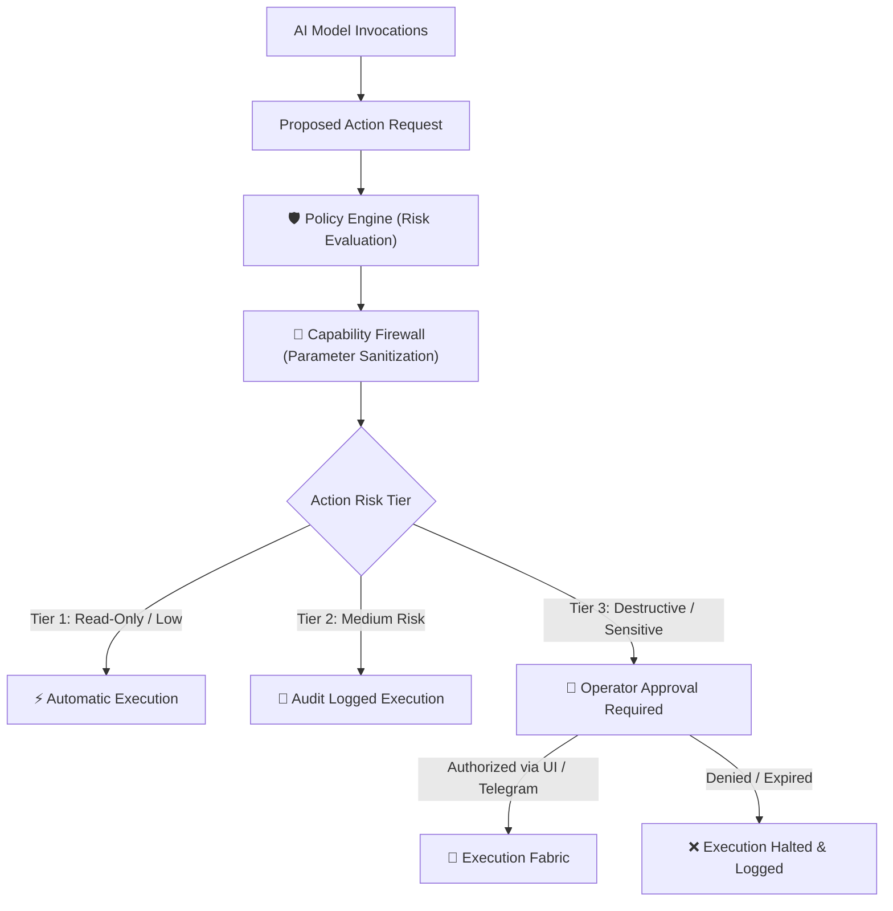

# 🔒 Security Policy

## 🛡️ Core Security Architecture

Security in **JARVIS** is founded on a central architectural tenet: **The AI model is never the trust boundary.**

Because large language models can be susceptible to prompt injection, hallucinated invocations, or adversarial context, JARVIS enforces a strict, defense-in-depth security model:

### 1. Capability Firewall & Path Sanitization
- Every tool action submitted to the Action Broker is filtered through the **Capability Firewall** (`src/jarvis/policy/firewall.py`).
- Shell commands, file operations, and IPC payloads are checked against blacklists for destructive operations (e.g. recursive deletions, disk wiping, registry alterations).
- All filesystem paths are resolved and validated to prevent directory traversal (`../`) attacks.

### 2. Interactive Operator Approvals
- Irreversible side effects (e.g. file deletions, arbitrary shell scripts, high-volume external messages) require explicit operator authorization.
- On the desktop, approvals surface via the interactive Neural Web UI.
- On mobile via Telegram, approvals utilize single-use, cryptographically verified inline button tokens with strict expiration timeouts.

### 3. Fail-Closed Remote Control
- The Telegram remote daemon operates under a strict whitelist boundary. Unregistered Telegram user IDs receive immediate access denials.
- Initial pairing requires a 256-bit entropy challenge nonce generated locally on the host machine (`jarvis telegram pair`) with a 5-minute time-to-live.
- Communication uses outbound HTTPS long-polling (`getUpdates`); zero inbound listening ports are exposed to the public Internet.

### 4. Credential & Private Data Isolation
- Application secrets, API keys, tokens, and database files must reside exclusively in `.env` and local untracked storage.
- Private session files (`sessions.json`, `conversations.json`, `*.log`, `*.jsonl`, `.env`, `coverage.xml`) are strictly gitignored.
- JARVIS never transmits private credentials to third-party endpoints or remote hosts.

---

## 📦 Supported Versions

Security updates and vulnerability patches are actively maintained for the following versions:

| Version | Supported | Status |
| :--- | :--- | :--- |
| `1.0.x` | ✅ Yes | Current Active Release |
| `< 1.0.0` | ❌ No | Deprecated Pre-release |

---

## 🚨 Reporting a Vulnerability

We take the security of JARVIS and our users' machines with utmost seriousness. If you discover a security vulnerability, please report it responsibly:

### How to Report
1. **Do NOT open a public GitHub issue** for undisclosed security vulnerabilities.
2. Send a detailed report to the security team or project maintainers via encrypted email or GitHub Private Vulnerability Reporting:
   - **Email:** `security@jarvis-project.local` (or maintainer contact listed in repository settings)
3. Include the following details in your report:
   - Detailed description of the vulnerability and attack vector
   - Step-by-step reproduction instructions or proof-of-concept
   - Potential impact on host systems, data integrity, or operator privacy
   - Any proposed remediations or patches

### Response Timeline
- **Initial Response:** Within 24 to 48 hours acknowledging receipt of the report.
- **Triage & Assessment:** Within 72 hours with an initial severity rating and reproduction status.
- **Patch & Disclosure:** A fix will be developed, tested against all quality gates, and released promptly. We coordinate public disclosure after patches have been published.
