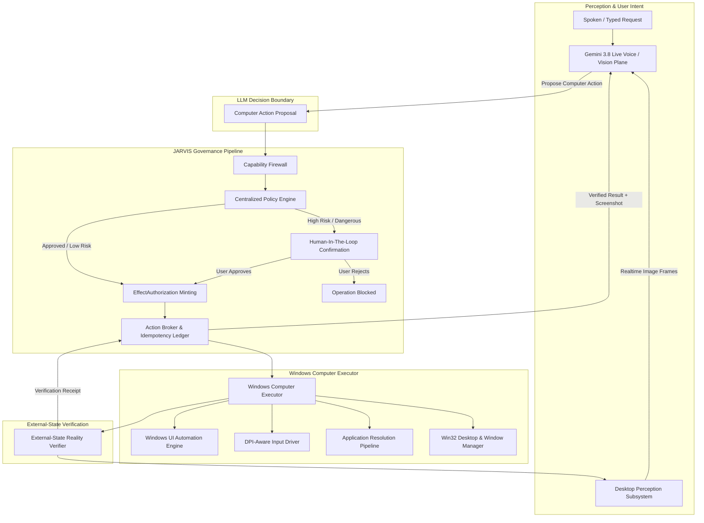
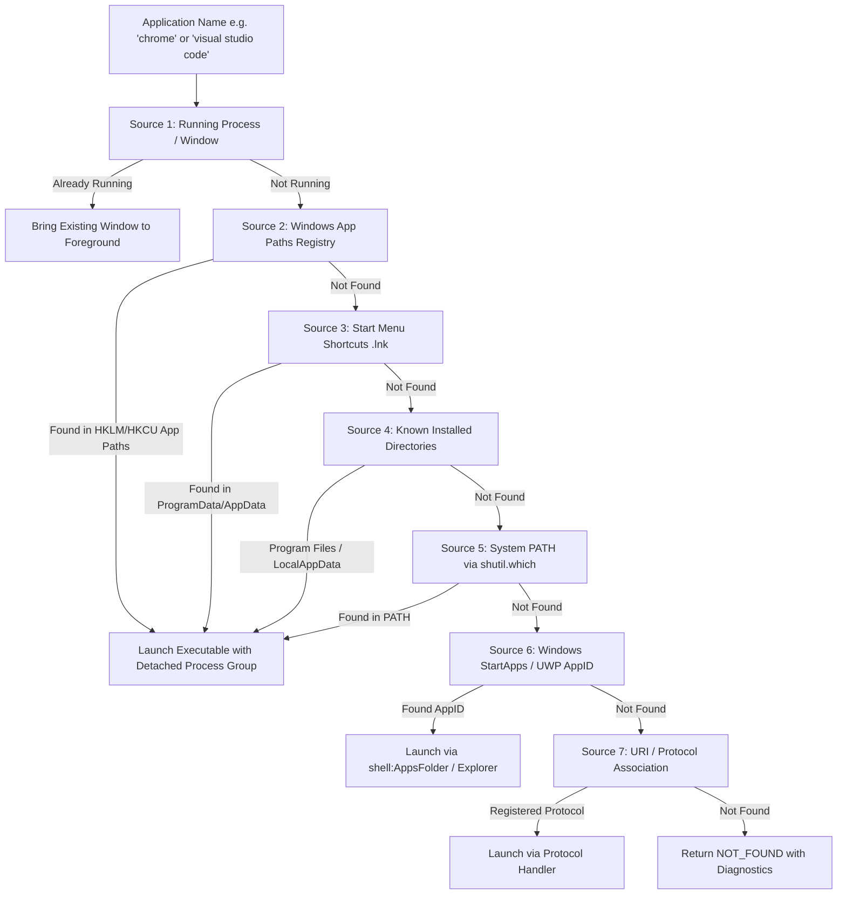
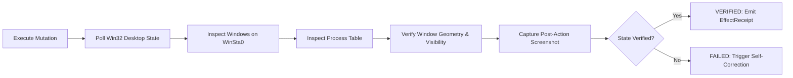
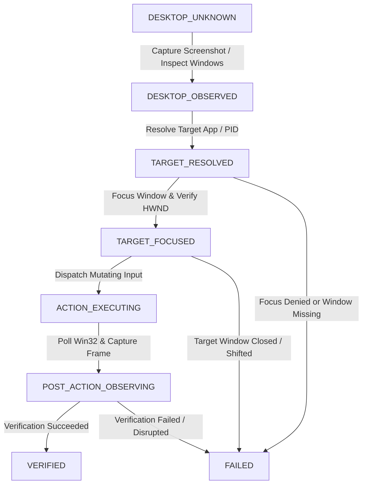

# JARVIS Computer Control Subsystem Specification

> **Architectural Specification for Governed Windows Operating System Perception and Control**  
> Document Version: 1.0.0 | Author: Antigravity Agentic Engineering  
> Scope: Windows Desktop Automation, Multi-Modal Vision, UI Automation, and Process Governance

---

## 1. Architectural Overview & System Topology

The JARVIS Computer Control Plane provides high-assurance, low-latency operating system control and desktop perception. It replaces brittle, unverified process spawns with a defense-in-depth architecture where the Large Language Model (Gemini 3.8 Live) possesses **zero ambient authority** over the host operating system.

### 1.1 Closed-Loop Governance Flow



The system strictly enforces that every computer mutation must traverse:
`Gemini 3.8 Live -> JARVIS Capability -> Capability Firewall -> Policy Engine -> HITL (if required) -> EffectAuthorization -> Action Broker -> Windows Computer Executor -> External-State Verification -> Screenshot -> Gemini`.

---

## 2. Threat Model & Security Boundaries

### 2.1 Threat Vectors and Controls

| Threat Vector | Potential Impact | Architectural Control |
| :--- | :--- | :--- |
| **Model Hallucination of OS Mutation** | False reporting that an application opened or closed when it did not. | **External-State Verification Reality Boundary**: Action is only acknowledged when window existence and process state are physically verified via Win32 API. |
| **Arbitrary OS Command Injection** | Malicious shell execution disguised as an application launch. | **Safe Identifier Enforcement**: Application names and paths are validated; shell syntax is strictly forbidden; no arbitrary shell execution escape exists in computer tools. |
| **System Process Termination** | Crashing the Windows operating system by terminating `csrss.exe`, `lsass.exe`, `wininit.exe`, or `dwm.exe`. | **Protected Process Blacklist**: The process termination capability maintains an immutable blacklist of Windows kernel and service processes. |
| **Stale Coordinate Misclicks** | Clicking arbitrary UI elements because the desktop state shifted between screenshot and click. | **Pre-Action Target Verification**: Validates window focus and bounding sanity; records pre-action screenshot digest to detect desktop shifts. |
| **Privilege Escalation via UAC** | Attempting to interact with elevated administrative prompts or secure desktops. | **Desktop State Detection**: Detects `SECURE_DESKTOP`, `LOCKED_DESKTOP`, and `ELEVATED_DESKTOP` boundaries honestly, refusing input where unauthorized. |
| **Token Exhaustion / Rate Flooding** | Model repeatedly emitting mouse clicks or screenshots in an infinite loop. | **Action Budgeting & Circuit Breakers**: The Action Broker enforces per-turn action budgets and trips circuit breakers on repeated failures. |

### 2.2 Desktop Permission Model

Windows isolates interactive desktops into distinct security boundaries:
1. `NORMAL_DESKTOP`: Standard interactive user desktop (`WinSta0\default`). JARVIS can inspect windows, capture frames, and inject input.
2. `ELEVATED_DESKTOP`: Elevated processes running with administrative privileges (UIAccess required for input injection).
3. `SECURE_DESKTOP`: User Account Control (UAC) prompts or Windows Security screen (`Winlogon`). Inaccessible to un-elevated user processes. JARVIS detects this state and honestly reports that user manual interaction is required.
4. `LOCKED_DESKTOP`: Windows workstation is locked (`WinSta0\Winlogon`). Desktop display surface is unavailable.
5. `UNAVAILABLE`: Headless environment or detached window station.

---

## 3. Capability Model

The Computer Control Plane replaces ad-hoc scripts with 22 canonical capabilities registered in `CapabilityRegistry`:

| Capability Identifier | Risk Class | Side Effect Class | Description |
| :--- | :--- | :--- | :--- |
| `computer:screenshot` | `READ_ONLY` | `NONE` | Capture desktop frame with dimension metadata and DPI awareness. |
| `computer:inspect_ui` | `READ_ONLY` | `NONE` | Inspect Windows UI Automation element hierarchy of the active or specified window. |
| `computer:click` | `BOUNDED_MUTATION` | `NON_IDEMPOTENT` | Inject single mouse click at coordinate or UIA element. |
| `computer:double_click` | `BOUNDED_MUTATION` | `NON_IDEMPOTENT` | Inject double mouse click at coordinate or UIA element. |
| `computer:right_click` | `BOUNDED_MUTATION` | `NON_IDEMPOTENT` | Inject right mouse click (context menu). |
| `computer:move_mouse` | `READ_ONLY` | `IDEMPOTENT` | Move mouse cursor to coordinates. |
| `computer:drag` | `BOUNDED_MUTATION` | `NON_IDEMPOTENT` | Drag mouse cursor from source to destination coordinates. |
| `computer:type` | `BOUNDED_MUTATION` | `NON_IDEMPOTENT` | Type text into currently focused control. |
| `computer:press_key` | `BOUNDED_MUTATION` | `NON_IDEMPOTENT` | Press a single key (Enter, Tab, Escape, Backspace). |
| `computer:hotkey` | `BOUNDED_MUTATION` | `NON_IDEMPOTENT` | Trigger keyboard combination (e.g. Ctrl+C, Alt+F4). |
| `computer:scroll` | `BOUNDED_MUTATION` | `NON_IDEMPOTENT` | Inject vertical mouse wheel scroll deltas. |
| `computer:focus_window` | `BOUNDED_MUTATION` | `IDEMPOTENT` | Bring specified window to foreground. |
| `computer:minimize_window` | `BOUNDED_MUTATION` | `IDEMPOTENT` | Minimize window. |
| `computer:maximize_window` | `BOUNDED_MUTATION` | `IDEMPOTENT` | Maximize window. |
| `computer:close_window` | `BOUNDED_MUTATION` | `NON_IDEMPOTENT` | Send graceful `WM_CLOSE` to window. |
| `computer:launch_app` | `BOUNDED_MUTATION` | `NON_IDEMPOTENT` | Launch desktop application via application-resolution pipeline. |
| `computer:list_windows` | `READ_ONLY` | `NONE` | List all visible top-level windows on the interactive desktop. |
| `computer:list_apps` | `READ_ONLY` | `NONE` | List installed applications from Start Menu and App Paths. |
| `computer:list_processes` | `READ_ONLY` | `NONE` | List active processes with window associations. |
| `computer:terminate_process` | `DANGEROUS` | `NON_IDEMPOTENT` | Terminate process by PID (governed, requires HITL). |
| `computer:wait` | `READ_ONLY` | `NONE` | Wait bounded seconds for UI transition. |
| `computer:verify_visual_state` | `READ_ONLY` | `NONE` | Compare visual hashes before and after an interaction. |

---

## 4. Computer Perception & Screenshot Pipeline

### 4.1 DPI Awareness and Multi-Engine Capture

1. **DPI Initialization**: The subsystem calls `ctypes.windll.shcore.SetProcessDpiAwareness(2)` (Per-Monitor v2 DPI awareness) upon initialization. This prevents Windows DPI virtualization from distorting physical screen metrics (e.g. mapping a 1920x1080 display to 1536x864).
2. **Desktop Attachment**: The worker thread attaches to `WinSta0\default` via `OpenDesktopW` and `SetThreadDesktop` to ensure capture is bound to the real interactive user desktop.
3. **Multi-Engine Strategy**:
   - Primary: Windows GDI Direct BitBlt / Direct3D desktop duplication for sub-10ms capture.
   - Fallback 1: High-speed multi-monitor `mss`.
   - Fallback 2: Standard PIL `ImageGrab`.
4. **Image Validation**: Before emitting an image:
   - Validates that bytes form a structurally valid JPEG or PNG header.
   - Asserts non-zero dimensions (`width > 0`, `height > 0`).
   - Enforces configurable byte-size bounds (default max 1.5MB).

### 4.2 Gemini 3.8 Live Image Streaming and 1007 Error Resolution

**Root Cause of 1007 Invalid Argument**:
In Gemini 3.8 Live WebSocket sessions, returning large base64-encoded image payloads directly inside `FunctionResponse.response` JSON triggers a protocol violation (`WebSocket 1007: Invalid Frame Payload Data`). Gemini Live is not designed to receive image files embedded inside tool JSON strings; it expects visual frames as realtime media inputs.

**Correct Architecture**:
1. **Realtime Image Channel**: The screenshot raw JPEG bytes are dispatched into the Live session via `LiveClientRealtimeInput`:
   ```python
   realtime_input = genai_types.LiveClientRealtimeInput(
       media_chunks=[
           genai_types.Blob(
               data=jpeg_bytes,
               mime_type="image/jpeg",
           )
       ]
   )
   await session.send(input=realtime_input)
   ```
2. **Concise Tool Response**: The `FunctionResponse` returns compact, informative metadata:
   ```json
   {
     "status": "success",
     "action": "screenshot",
     "width": 1920,
     "height": 1080,
     "mime_type": "image/jpeg",
     "byte_size": 142580,
     "message": "Desktop screenshot captured and streamed into session."
   }
   ```
This completely eliminates the 1007 protocol error while allowing Gemini to perceive the visual desktop frame naturally.

---

## 5. Windows UI Automation (UIA) Pipeline

### 5.1 Native `UIAutomationCore` Integration

For modern Windows applications (Win32, WPF, UWP, Electron, and Chromium), semantic interaction is significantly more robust than blind coordinate clicking.

1. **UIA Engine**: Interfaces with `UIAutomationCore.dll` natively via `ctypes` (`UiaNodeFromHandle`, `UiaGetPropertyValue`).
2. **Element Identification**: Supports resolving elements by:
   - `Name`: Accessible control label (e.g. `"Save"`, `"Close"`, `"Address and search bar"`).
   - `AutomationId`: Developer-assigned control ID.
   - `ControlType`: Standard UIA control types (Button, Edit, ComboBox, MenuItem, TabItem).
   - `ClassName`: Underlying Win32 window class.
3. **Semantic Actions**:
   - Where supported by the target element, invokes UIA patterns (`InvokePattern` for buttons, `ValuePattern` for text).
   - Where patterns are unsupported, computes the exact bounding rectangle of the semantic element (`GetBoundingRectangle`) and clicks the center coordinate.

---

## 6. Coordinate Safety & Transformation Pipeline

### 6.1 Coordinate Normalization and Validation

Gemini models frequently reason in normalized `[0, 999]` coordinates. The coordinate engine bridges normalized model coordinates with physical desktop pixels:

```
pixel_x = monitor_left + int((normalized_x / 999.0) * monitor_width)
pixel_y = monitor_top  + int((normalized_y / 999.0) * monitor_height)
```

### 6.2 Safety Invariants:
1. **Bounds Validation**: Asserts that `pixel_x` and `pixel_y` reside strictly inside the active monitor bounds or virtual screen rectangle (`SM_CXVIRTUALSCREEN`, `SM_CYVIRTUALSCREEN`).
2. **Multi-Monitor Awareness**: Correctly accounts for negative offsets on secondary displays positioned to the left of or above the primary monitor.
3. **Stale Coordinate Protection**: If the target window moves or loses focus between perception and execution, the action is rejected with `STALE_COORDINATES`.

---

## 7. Application Resolution Pipeline

The naive approach of assuming an application name equals an executable in the system `PATH` causes frequent launch failures. The JARVIS Application Resolver implements a 7-source discovery pipeline:



### 7.1 Structured Resolution Result
`AppResolution` returns:
- `status`: `FOUND`, `NOT_FOUND`, `AMBIGUOUS`, `LAUNCH_FAILED`, `LAUNCHED_UNVERIFIED`, `LAUNCHED_AND_VERIFIED`.
- `resolved_path`: Full physical path to `.exe` or `.lnk`.
- `source`: Which pipeline step resolved the executable.

---

## 8. Process & Window Management Model

### 8.1 Distinct Window vs Process Operations
- **`computer:close_window`**: Sends `WM_CLOSE` to the specific window handle. Allows the application to save state or prompt user.
- **`computer:terminate_process`**: Forces termination of the target process PID via `psutil`. Subject to strict security policy (blacklists protected system processes) and requires HITL approval.

### 8.2 Real Process Inspection
`computer:list_processes` and `computer:list_windows` query live Win32 handles on the `WinSta0\default` desktop. A process is never classified as "running an application" unless verified against active process tables, and is never classified as "having a visible window" unless an actual visible, non-minimized, non-tool window with geometry > 10x10 is detected.

---

## 9. External-State Verification & Reality Boundary

Mutating computer capabilities do not rely on process exit codes or API return values. They mandate physical state verification:



### Verification Verbs:
- **`computer:launch_app`**: Verifies:
  1. `PROCESS_CREATED`: PID exists in process table.
  2. `WINDOW_FOUND`: Window handle with matching PID exists on `WinSta0\default`.
  3. `WINDOW_VISIBLE`: Window is visible with width > 50 and height > 50.
  4. `WINDOW_FOREGROUND`: Window successfully brought to foreground.
- **`computer:close_window`**: Verifies:
  1. `WINDOW_GONE`: Window handle is destroyed.
  2. `PROCESS_GONE`: (If process had only one window and exited).
- **`computer:click` / `type` / `scroll`**: Verifies:
  1. `CLICK_EXECUTED`: Input events dispatched without error.
  2. `POST_ACTION_SCREENSHOT`: Screenshot captured.
  3. `EXPECTED_STATE_DETECTED`: Visual hash or UI element state reflects the intended change.

---

## 10. Policy Engine & HITL Integration

The Central Policy Engine scores all computer capabilities:
- **`READ_ONLY`** (`screenshot`, `list_windows`, `list_apps`, `inspect_ui`): Risk score = 0.0 -> `ALLOW`.
- **`BOUNDED_MUTATION`** (`click`, `type`, `scroll`, `launch_app`, `focus_window`, `close_window`): Risk score = 0.3 -> `ALLOW` under default autonomy (`AUTO_BOUNDED_MUTATION`), provided target is within safe bounds.
- **`DANGEROUS`** (`terminate_process`): Risk score = 0.7+ -> **`REQUIRE_APPROVAL`** (Human-In-The-Loop interactive prompt required).

---

## 11. Telemetry & Observability

Every computer action emits structured telemetry:
- `span_name`: `computer.<action>` (e.g. `computer.launch_app`, `computer.click`).
- Attributes: `app_name`, `resolved_path`, `pid`, `window_handle`, `coordinates`, `execution_time_ms`, `verification_status`.
- Screen captures are fingerprinted via SHA-256 digests. Raw image bytes are never serialized into persistent text audit logs.

---

## 12. Windows Platform Constraints & Limitations

1. **UAC Secure Desktop**: When Windows displays a full-screen User Account Control prompt, the system transitions to `Winlogon` secure desktop. User-mode software cannot inject keystrokes or mouse clicks into this desktop without specific digital signatures and `uiAccess="true"` manifest flags. JARVIS detects this condition and warns the user instead of hanging or failing silently.
2. **Workstation Lock**: If the user locks Windows (Win+L), the interactive desktop surface becomes inaccessible (`DISPLAY_SURFACE_UNAVAILABLE`).
3. **Multi-DPI Setups**: When multiple monitors have different DPI scaling settings (e.g. 4K monitor at 150% and 1080p monitor at 100%), coordinates must be transformed relative to the specific monitor's virtual coordinate space.

---

## 13. Test Strategy

1. **Unit Tests**: Mocked Win32 handles, DPI math validation, coordinate transformation tests, application resolution tree tests.
2. **Integration Tests (Windows)**: Real desktop attachment, live window enumeration, Start Menu indexing, DPI awareness verification.
3. **Gemini Live Contract Tests**: Image frame byte validation, function response schema validation, protocol 1007 avoidance tests.
4. **Manual Acceptance Suite**: End-to-end tests across Edge, VS Code, YouTube navigation, screenshot descriptions, and button clicks.

---

## 14. Action Dependency Enforcement & Precondition Governance

### 14.1 Top-Level Governance Invariant
> **MANDATORY CONTROL-FLOW INVARIANT**:  
> A computer action may not execute when a mandatory prerequisite action has failed, been denied, timed out, become stale, or lacks verified postcondition evidence.

Under no circumstances may input injection capabilities (`computer:type`, `computer:click`, `computer:hotkey`) blindly broadcast events into an ungrounded or unverified foreground window. Every mutating action is gated behind strict zero-trust precondition evaluation.

### 14.2 Execution Lifecycle Finite State Machine
The `ComputerActionStateMachine` tracks desktop interaction lifecycles across distinct phases:



### 14.3 Strict Precondition Evaluation Gates

Before any action dispatch occurs in `WindowsComputerExecutor`, the capability arguments and ambient desktop state are verified:

1. **Failure Cascade Guard**: If a prior prerequisite action in a chain returned `DENIED` or `FAILED`, dependent mutating actions immediately fail closed with reason code `PRECONDITION_NOT_SATISFIED`. The action is rejected before any input hardware driver or Win32 message is invoked.
2. **Foreground Window Integrity Guard**: Keystroke injection (`computer:type`) asserts that:
   - An active target window is resolved and focused (`TARGET_FOCUSED` or `VERIFIED`).
   - The registered target HWND physically exists (`IsWindow(hwnd)` returns true). If not, execution is rejected with `WINDOW_NOT_FOUND`.
   - The active foreground window (`GetForegroundWindow()`) exactly matches the target HWND. If another process or window has seized focus, execution is rejected with `WINDOW_NOT_FOREGROUND`.
3. **Structured Categorical Reason Codes**:
   All denials, failures, and rejections emit strongly-typed reason codes defined in `ComputerActionReasonCode`:
   - `WINDOW_NOT_FOUND`: Target window handle or title does not exist.
   - `WINDOW_NOT_VISIBLE`: Target window is minimized, hidden, or collapsed.
   - `WINDOW_NOT_FOREGROUND`: Target window is not in the active foreground.
   - `AMBIGUOUS_TARGET`: Multiple matching windows or applications discovered.
   - `UI_ELEMENT_NOT_FOUND`: Specified UI Automation element query failed.
   - `PRECONDITION_NOT_SATISFIED`: Mandatory prerequisite action failed, was denied, or is stale.
   - `STALE_SCREEN_STATE`: Screen visual content shifted unexpectedly prior to mutation.
   - `POLICY_DENIED`: Action blocked by Central Policy Engine.
   - `HITL_REQUIRED`: Action requires explicit human approval token.
   - `OUT_OF_BOUNDS`: Coordinates fall outside display or window rect.
   - `TARGET_EXITED`: Target process terminated unexpectedly.
   - `DESKTOP_UNAVAILABLE`: WinSta0 desktop disconnected or locked.
   - `SECURE_DESKTOP`: Windows UAC or credential prompt active.
   - `ACTION_TIMEOUT`: Execution or verification timed out.
   - `VERIFICATION_FAILED`: Post-action state assertion did not pass.

Every rejected or denied action returns a canonical structured dictionary containing `status`, `reason_code`, `message`, `suggested_action`, and `retryable` metadata, providing unambiguous diagnostic context to the user and caller.

---

## 15. Dynamic UI Automation Targeting Architecture

### 15.1 Architectural Elimination of Coordinate Guessing

To guarantee deterministic, reliable computer control across arbitrary desktop applications (Chromium, Electron, Win32, WPF, UWP), the subsystem completely eliminates coordinate guessing. In place of asking multi-modal models to guess pixel coordinates from downscaled screenshots, JARVIS dynamically queries the live Windows UI Automation (UIA) tree, computes exact clickable coordinates, validates them against live hit-testing APIs, and enforces messaging safety boundaries.

```
CURRENT WINDOW
    ↓
UI Automation tree traversal (UIA COM / pywinauto)
    ↓
SEMANTIC ELEMENT RESOLUTION (Role, Name, ControlType scoring)
    ↓
ELEMENT IDENTITY (AutomationId, RuntimeId, ControlType)
    ↓
GET CLICKABLE POINT OR BOUNDING RECTANGLE
    ↓
PHYSICAL SCREEN COORDINATE (DPI-aware desktop pixels)
    ↓
POINT / ELEMENT VALIDATION (Live ElementFromPoint hit-testing)
    ↓
INPUT (DPI-aware Win32 SendInput or UIA Pattern Invocation)
    ↓
POST-ACTION VERIFICATION (Visual and accessibility state assertion)
```

### 15.2 Coordinate Transformation Contracts

JARVIS supports three distinct coordinate representations across the perception and execution boundary:
1. **Physical Desktop Pixels (`TargetSource.PHYSICAL_PIXELS`)**: Exact integer screen coordinates `(px, py)` on the Windows desktop coordinate space. Used directly by `SendInput`.
2. **Normalized Unit Floats (`[0.0, 1.0]`)**: Common for computer vision models where `(0.5, 0.5)` represents display center.
3. **Normalized Mille Integers (`[0, 999]`)**: Common for Gemini Live function calling parameters where `500, 500` represents display center.

The canonical transformation formula:
```
if is_unit_float:
    px = monitor_left + int(norm_x * monitor_width)
    py = monitor_top  + int(norm_y * monitor_height)
elif is_mille:
    px = monitor_left + int((norm_x / 999.0) * monitor_width)
    py = monitor_top  + int((norm_y / 999.0) * monitor_height)
```

### 15.3 Semantic Role & Element Scoring

Dynamic element resolution scores accessibility tree nodes against natural language queries without hardcoded application identifiers:
- **Exact Name Match**: Score +100
- **Case-Insensitive Substring Match**: Score +50
- **Semantic Role Match** (e.g. `Edit`, `Button`, `ListItem`, `TabItem`): Score +30
- **Enabled & Visible State**: Score +20
- **Interactive Control Pattern Support** (`InvokePattern`, `ValuePattern`): Score +20

### 15.4 Live ElementFromPoint Verification & Occlusion Defense

Prior to mouse event dispatch:
1. `windows_api.element_from_point(px, py)` retrieves the live UIA element at the target coordinates.
2. The hit element is compared with the target element (`RuntimeId` or window handle correlation).
3. If an overlapping window, modal prompt, or popup menu has occluded the target, execution fails closed with `STALE_TARGET` or `WINDOW_NOT_FOREGROUND`.

### 15.5 Messaging Safety Boundaries

To prevent injecting text or messages into unintended conversations (such as WhatsApp, Teams, or Slack):
1. When typing with an explicit `recipient` parameter, the resolver inspects the active chat header or title in the accessibility tree.
2. If the active conversation recipient does not match the target recipient, execution fails closed with reason code `CHAT_RECIPIENT_MISMATCH`.
3. An active chat cannot receive automated text sends unless the recipient is positively grounded.

### 15.6 Visual Perception Fallback Path

For legacy Win32 applications, custom canvas renderers, or Direct3D games that do not expose an accessible UIA tree:
1. The subsystem detects that UIA traversal returned zero usable interactive descendants.
2. The executor flags `TargetSource.VISUAL_GROUNDING` as active.
3. A high-resolution desktop frame is captured and analyzed for text elements or visual bounding boxes.
4. Input is guarded by strict pre-action and post-action visual hash verification, preventing ungrounded coordinate guessing.

