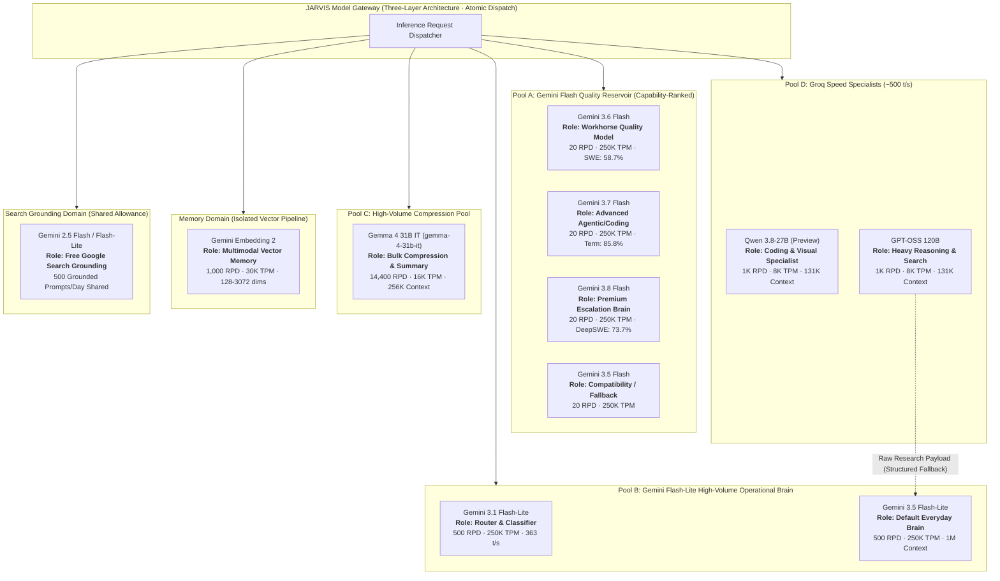

# JARVIS v1.0.0: Model Roster & Quota-Aware Gateway Specification
## Operational Model Inventory, Capability Routing & Quota Allocation Matrix
*Classification: Engineering Design Document (Model Plane Baseline)*  
*Version: 1.0.0-CANONICAL*  
*Target System: Free-Tier Distributed Inference Reservoir for JARVIS v1.0.0*

---

## 1. Executive Summary & The "Zero-Cost, Quota-Resilient Availability" Strategy

In production agent systems, relying on a single frontier model results in rapid rate-limit failures (HTTP 429), token exhaustion, or unsustainable operational bills. 

JARVIS v1.0.0 addresses this by engineering a **Heterogeneous Model Reservoir**. By decomposing agentic responsibilities across model classes with independent quotas on Google AI Studio and Groq Cloud, JARVIS operates under a **nominal aggregate daily operation ceiling of 18,980 operations** and **1,562,000 aggregate nominal configured per-minute token quota across generation + embedding domains** across multiple isolated operational pools.

> [!IMPORTANT]
> **Heterogeneous, Non-Fungible Ceilings:** The aggregate figure of 18,980 daily operations represents a mathematical summation of distinct, independently enforced quota dimensions across providers:
> * 80 Flash Quality generation requests (Pool A: 4 models @ 20 RPD)
> * 1,000 Flash-Lite operational generation requests (Pool B: 2 models @ 500 RPD)
> * 14,400 Gemma 4 31B IT compression/summarization operations (Pool C: `gemma-4-31b-it` @ 14,400 RPD)
> * 2,000 Groq speed specialist requests (Pool D: 2 models @ 1,000 RPD)
> * 1,000 Multimodal vector embedding operations (`gemini-embedding-2`)
> * 500 Google Search grounding operations (`gemini-2.5-flash` / Lite shared grounding allowance)
> 
> These quotas are **not** fungible. An unused search-grounding allowance cannot be converted into a code-generation request, nor does a high RPD on Gemma 4 compensate for TPM exhaustion on Groq. The Model Gateway manages each dimension as an isolated rate-limit domain. The figure of 1,562,000 TPM represents an aggregate nominal configured per-minute token quota across generation + embedding domains, not a single shared throughput capacity or homogeneous token metric (*Google Gemini TPM is an input-token/minute dimension; Groq TPM is a combined token/minute dimension unless separate ITPM/OTPM limits are configured*). Search Grounding is a separate 500 grounded-prompts/day quota domain and is excluded from the TPM aggregate.

### Core Architectural Invariants

1. **Architecture is Frozen; Provider Quota Values Are Runtime Configuration:** Google AI Studio and Groq rate limits vary by model, region, and project, and can be adjusted dynamically by providers. The gateway architecture, role policies, three-layer quota isolation, and recovery contracts are permanent; the numeric quota limits are loaded from configuration and continuously calibrated by provider response headers.
2. **Quotas Are Project-Scoped and Model-Specific:** Quota limits are enforced at the project level and vary by model and applicable quota dimension; the gateway treats each model/domain bucket independently according to the active runtime configuration. Invoking `gemini-3.6-flash` does not consume the rate-limit bucket of `gemini-3.8-flash` or `gemini-3.5-flash-lite`.
3. **Capability-Weighted Allocation > Dumb Round-Robin:** Models are invoked according to empirical benchmark strengths, task capability constraints, and real-time quota availability, preserving scarce frontier reasoning models for genuinely complex problems.
4. **Resilience Over Absolute Guarantees:** Third-party free-tier endpoints cannot guarantee zero downtime. JARVIS is engineered for **Quota-Resilient High Availability & Graceful Degradation** through two-phase token/request reservation, atomic admission control, rate-limit header reconciliation, and capability-aware fallback ladders.
5. **Token Economics Over Raw RPD:** Raw Request-Per-Day (RPD) does not equal useful task capacity. A 14,400 RPD model with a 16K TPM limit requires different operational pacing than a 20 RPD model with a 250K TPM window. Capacity is planned around **Effective Daily Tasks**, with task estimates calibrated empirically by runtime telemetry.
6. **Decoupled Autonomy & Model Selection:** Autonomy level (Levels 0–5) is a security/authorization property governed by the Policy Engine. Model selection is a technical capability optimization governed by the Model Gateway. High autonomy does not automatically force Gemini 3.8; selection is driven by task complexity, required modalities, context length, and tool constraints.
7. **Zero-Trust Model Boundary:** Models only propose intent. Authorization, action brokering, circuit breaking, and external-state verification remain strictly deterministic and centralized outside the LLM.

---

## 2. Master Model Plane Architecture & Topology Diagram

The following diagrams illustrate the flow of inference requests through the Model Gateway into the operational pools, memory domain, and search grounding allowance:

### Visual Mermaid Topology



### Complete Operational Flowchart

```text
                                 JARVIS MODEL GATEWAY
                     (Three-Layer Architecture · Atomic Dispatch)
                                          │
                  ┌───────────────────────┴───────────────────────┐
                  │                                               │
           POOL B (FLASH-LITE)                             POOL A (FLASH)
                  │                                               │
       3.1 Lite = ROUTER / CLASSIFIER                 3.6 Flash = QUALITY WORKHORSE
       (500 RPD · 250K TPM)                           (20 RPD · 250K TPM)
                  │                                               │
       3.5 Lite = DEFAULT EVERYDAY BRAIN              3.7 Flash = ADVANCED AGENTIC/CODING
       (500 RPD · 250K TPM)                           (20 RPD · 250K TPM)
                  │                                               │
                  │                                   3.8 Flash = PREMIUM ESCALATION
                  │                                   (20 RPD · 250K TPM)
                  │                                               │
                  │                                   3.5 Flash = COMPATIBILITY FALLBACK
                  │                                   (20 RPD · 250K TPM)
                  │                                               │
                  └───────────────────────┬───────────────────────┘
                                          │
                 ┌────────────────────────┼────────────────────────┐
                 ▼                        ▼                        ▼
              POOL D                   POOL D                   POOL C
       QWEN 3.8-27B (PREVIEW)       GPT-OSS 120B            GEMMA 4 31B IT
           Coding & Visual         Heavy Reasoning &        (gemma-4-31b-it)
             Specialist              Browser Search         Bulk Compression
          (1K RPD · 8K TPM)        (1K RPD · 8K TPM)      (14.4K RPD · 16K TPM)
                                          │
                                          └── Multi-Stage Structured Fallback
                                              (Search via OSS ──► Extract via Lite)

                 ┌────────────────────────┴────────────────────────┐
                 ▼                                                 ▼
            MEMORY DOMAIN                                SEARCH GROUNDING DOMAIN
         Gemini Embedding 2                           Gemini 2.5 Flash / Flash-Lite
       (1K RPD · 30K TPM Unified)                     (500 Grounded Prompts/Day Shared)
```

---

## 3. Complete Model Quota Inventory Table

The following matrix represents the **observed free-tier limits in the project environment at baseline capture time**, categorized by **Quota Domain**:

| Domain | Pool | Model Identifier | Provider | RPM | TPM | RPD | TPD | Native Context | Primary Role |
| :--- | :--- | :--- | :--- | :---: | :---: | :---: | :---: | :---: | :--- |
| **GENERATION** | **Pool B** | `gemini-3.1-flash-lite` | Google | 15 | 250K | **500** | - | 1,048,576 | Preferred Router & Lightweight Classifier |
| **GENERATION** | **Pool B** | `gemini-3.5-flash-lite` | Google | 15 | 250K | **500** | - | 1,048,576 | **Default Everyday Brain** |
| **GENERATION** | **Pool A** | `gemini-3.6-flash` | Google | 5 | 250K | **20** | - | 1,048,576 | **Workhorse Quality Model** |
| **GENERATION** | **Pool A** | `gemini-3.7-flash` | Google | 5 | 250K | **20** | - | 1,048,576 | Advanced Agentic & Coding Tier |
| **GENERATION** | **Pool A** | `gemini-3.8-flash` | Google | 5 | 250K | **20** | - | 1,048,576 | **Premium Escalation Brain & Vision** |
| **GENERATION** | **Pool A** | `gemini-3.5-flash` | Google | 5 | 250K | **20** | - | 1,048,576 | Compatibility / Fallback Slot |
| **GENERATION** | **Pool C** | `gemma-4-31b-it` | Google | 30 | 16K | **14,400** | - | 262,144 | High-Volume Compression & Summarizer |
| **GENERATION** | **Pool D** | `qwen/qwen3.8-27b` *(Preview)* | Groq | 30 | 8K | **1,000** | 200K | 131,072 | Fast Multimodal / Coding Specialist (~450 t/s) |
| **GENERATION** | **Pool D** | `openai/gpt-oss-120b` | Groq | 30 | 8K | **1,000** | 200K | 131,072 | Heavy Reasoning & Browser Search (~500 t/s) |
| **EMBEDDING**  | **Memory** | `gemini-embedding-2` | Google | 100 | 30K | **1,000** | - | Unified | Multimodal Vector Embeddings |
| **SEARCH_GROUNDING** | **Search** | `gemini-2.5-flash` / `lite` | Google | - | - | **500\*** | - | 1,048,576 | Shared Free Google Search Grounding Allowance (500 grounded prompts/day shared) |

*\*Note on Quota Domains: The nominal aggregate daily operation ceiling is **18,980 operations/day** across independently enforced quota domains. The **1,562,000 TPM** figure represents the aggregate nominal configured per-minute token quota across generation + embedding domains, representing the mathematical sum of distinct, non-fungible provider pipes (*Google Gemini TPM is an input-token/minute dimension; Groq TPM is a combined token/minute dimension unless separate ITPM/OTPM limits are configured*). Search Grounding is a separate 500 grounded-prompts/day quota domain and is excluded from the TPM aggregate (RPM/TPM are not applied to the grounding allowance itself; standard generation RPM/TPM apply separately to underlying model calls).*

---

## 4. Detailed Specification of the Operational Pools

### Pool A: The Gemini Flash Quality Reservoir
* **Nominal Aggregate Capacity:** 80 Requests / Day · 1,000,000 Combined TPM (4 independent 250K TPM buckets).
* **Conceptual Hierarchy:**  
  $$\text{Gemini 3.8 Flash} > \text{Gemini 3.7 Flash} > \text{Gemini 3.6 Flash} > \text{Gemini 3.5 Flash}$$
* **Generational Roles & Empirical Justifications:**
  * `Gemini 3.6 Flash` (**The Workhorse Quality Model**): Google explicitly designates 3.6 as its workhorse, delivering significant gains over 3.5 in coding, knowledge work, multimodal performance, and token efficiency. In Google's evaluations, 3.6 outperforms 3.5 across critical agentic benchmarks: SWE-Bench Pro (58.7% vs 55.1%), MLE-Bench (63.9% vs 49.7%), OSWorld (83.0% vs 78.4%), and 128K MRCR (91.8% vs 77.3%).
  * `Gemini 3.7 Flash` (**Advanced Agentic Coding Tier**): Delivers higher agentic coding performance (DeepSWE: 65.3%, Terminal-Bench: 85.8%, 128K MRCR: 97.0%, HLE-Verified: 53.6%). Deployed for deep terminal interactions, multi-file code editing, and complex algorithmic debugging.
  * `Gemini 3.8 Flash` (**Premium Escalation Brain & Vision**): Google's most intelligent Flash model, specifically engineered for long-horizon software engineering, autonomous agents, and complex workflows. Features 1M context, 64K output, function calling, Search, computer use, code execution, file search, structured output, thinking, and URL context. Benchmark metrics: DeepSWE v1.1: **73.7%**, GDPVal-AA v2: **1545 Elo**, Finance Agent v2: **61.4%**. Reserved for high-complexity escalations, long-horizon SWE tasks, and multimodal screen perception.
  * `Gemini 3.5 Flash` (**Compatibility & Fallback Slot**): High-stability baseline model with 1M context and 64K output, acting as the stable model fallback buffer within Pool A. (Security boundaries remain strictly governed by the Policy Engine and Action Broker, not model tiers.)

### Pool B: The Gemini Flash-Lite High-Volume Operational Brain Pool
* **Nominal Aggregate Capacity:** 1,000 Requests / Day · 500,000 Combined TPM (2 independent 250K TPM buckets) · 1,048,576-token native context per Gemini model.
* **Preferred Router & Lightweight Classifier (`gemini-3.1-flash-lite`):**
  * Primary responsibility: Layer 07 (Capability Router & Intent Classifier).
  * Fast generation (363 t/s) and GPQA Diamond (86.9%) provide high-precision classification into Fast, Specialist, Deep, or Event paths.
  * *Non-Exclusive Role:* When routing traffic is low, 3.1 Flash-Lite remains fully eligible for intent normalization, lightweight preprocessing, memory candidate extraction, translation, and structured data extraction.
* **Default Everyday Brain (`gemini-3.5-flash-lite`):**
  * Handles ~80% of all user interactions, tool invocations, and domain specialist execution.
  * Targeted by Google specifically at high-throughput agentic workflows, subagent loops, and document processing.
  * Published benchmark advantage over 3.1 Flash-Lite: SWE-Bench Pro (54.2% vs 38.3%), Terminal-Bench 2.1 (54.0% vs 31.0%), OSWorld (74.0% vs 54.3%), and 128K MRCR (72.2% vs 60.1%), combining strong agentic competence with a 500 RPD / 250K TPM allocation.

### Pool C: The Gemma 4 31B IT High-Volume Compression Pool (`gemma-4-31b-it`)
* **Canonical API Identifier:** `gemma-4-31b-it`
* **Total Capacity:** 14,400 Requests / Day · 30 RPM · 16K TPM · 256K Context Window.
* **Role:** Context Compaction, Transcript Summarization, Fact Extraction & Output Polish.
* **Response Policy (Semantic Fidelity Preservation):**  
  To prevent lower-intelligence models from distorting or omitting subtle facts on complex tasks, the final synthesis follows an explicit policy:
  * **Simple / Conversational Tasks:** Gemma 4 31B IT (`gemma-4-31b-it`) synthesizes final concise prose.
  * **Normal Tool Tasks:** Gemini 3.5 Flash-Lite produces the verified response.
  * **Complex / High-Stakes / Escalated Work:** The **originating reasoning model** (e.g., Gemini 3.8 Flash, Gemini 3.7 Flash, Qwen 3.8, or GPT-OSS 120B) generates the final user-facing response directly, ensuring zero semantic degradation.
* **Architectural Restriction:** Gemma 4 31B IT is strictly a worker. It is **never** authorized to approve policies, bypass verification, or execute side-effect tools.

### Pool D: The Groq Speed Specialist Pool
* **Nominal Aggregate Capacity:** 2,000 Requests / Day · 60 RPM Combined · 16K Combined TPM · 400K Combined TPD.
* **Fast Interactive Multimodal / Coding Specialist (`qwen/qwen3.8-27b` - Preview):**
  * *Status:* Preview model on GroqCloud; treated as a preview dependency with automated fallback.
  * LiveCodeBench: 90.3%, SWE-Bench Pro: 61.7%, GPQA Diamond: 89.2%, Terminal-Bench: 73.0%.
  * Ultra-low latency (~450+ t/s) with 131,072 context, 16K max output, and native image perception.
  * Dispatched for rapid coding loops, visual debugging, AST refactoring, and compact subagent turns.
* **Heavy Reasoning & Browser Search Specialist (`openai/gpt-oss-120b`):**
  * 117B total / 5.1B active parameter open-weight reasoning MoE (~500 t/s, 131K context, 65K output).
  * Native Groq built-in **Browser Search** and **Code Execution**.
  * Dispatched for deep multi-source research, competitor analysis, and literature exploration.
* **Crucial Tool-Mode Compatibility Constraint:**
  > [!WARNING]
  > **Groq Incompatibility:** On Groq Cloud, **Browser Search cannot be combined with strict structured output mode (`json_schema`)**. 
  > The Model Gateway treats `required_tool_mode = BROWSER_SEARCH` and `structured_output = True` as mutually exclusive constraints. When structured extraction is required alongside search, the gateway routes to a multi-stage pipeline:
  > $$\text{GPT-OSS 120B (Browser Search)} \longrightarrow \text{Raw Research Payload} \longrightarrow \text{Gemini 3.1 / 3.5 Flash-Lite (Structured JSON Extraction)}$$
  > or dispatches directly to Gemini 2.5 Flash with native Google Search grounding.

---

## 5. Capability-Aware Dynamic Failover Matrix & Role Rankings

Failover never follows a blind universal chain. The Model Gateway selects the **Nearest Semantically Compatible Model** satisfying required capabilities:

```text
┌───────────────────────────┬───────────────────────────────┬───────────────────────────────┐
│ Task Capability Required  │ Primary Model                 │ Capability-Aware Fallback     │
├───────────────────────────┼───────────────────────────────┼───────────────────────────────┤
│ Multimodal / Screen Vision│ Gemini 3.8 Flash (Pool A)     │ Qwen 3.8-27B (Groq)           │
│ Long Context (>131K)      │ Gemini 3.5 Flash-Lite (Pool B)│ Gemini 3.6 / 3.5 Flash (Pool A)│
│ Built-in Browser Search   │ GPT-OSS 120B (Groq)           │ Gemini 2.5 Flash + Search API │
│ Fast Interactive Coding   │ Qwen 3.8-27B (Groq)           │ Gemini 3.5 Flash-Lite (Pool B)│
│ General Tool Orchestration│ Gemini 3.5 Flash-Lite (Pool B)│ Gemini 3.1 Flash-Lite (Pool B)│
│ Deep Planning / SWE       │ Gemini 3.8 Flash (Pool A)     │ Gemini 3.7 Flash (Pool A)     │
└───────────────────────────┴───────────────────────────────┴───────────────────────────────┘
```

### Operational Suitability Ranking Under JARVIS Free-Tier Constraints
> *(Reflects composite operational suitability under free-tier quotas, latency requirements, and tool constraints; this is an operational resource allocation matrix, not a raw parameter-intelligence ranking.)*

1. **Default Everyday Agent:**  
   `Gemini 3.5 Flash-Lite` > `Gemini 3.1 Flash-Lite` > `Gemini 3.6 Flash` > `Qwen 3.8-27B` > `GPT-OSS 120B` > `Gemma 4 31B IT`
2. **Hard Reasoning / Escalation:**  
   `Gemini 3.8 Flash` > `Gemini 3.7 Flash` > `Gemini 3.6 Flash` > `GPT-OSS 120B` > `Qwen 3.8-27B` > `Gemini 3.5 Flash-Lite`
3. **Agentic Coding & Terminal:**  
   `Gemini 3.8 Flash` > `Qwen 3.8-27B` > `Gemini 3.7 Flash` > `Gemini 3.6 Flash` > `GPT-OSS 120B` > `Gemini 3.5 Flash-Lite`
4. **High-Volume Summarization & Compaction:**  
   `Gemma 4 31B IT` (`gemma-4-31b-it`) > `Gemini 3.5 Flash-Lite` > `Gemini 3.1 Flash-Lite`
5. **Vision & Multimodal Perception:**  
   `Gemini 3.8 Flash` > `Gemini 3.7 Flash` > `Gemini 3.6 Flash` > `Gemini 3.5 Flash-Lite` > `Qwen 3.8-27B` > `Gemma 4 31B IT`
6. **Memory Embeddings:**  
   `Gemini Embedding 2`
7. **Built-in Web Research:**  
   `GPT-OSS 120B` (Groq Browser Search) > `Gemini 2.5 Flash` (Search Grounding) > Native JARVIS Search Tool + Any Reasoner

*Emergency Fallback:* If all primary Google and Groq pools are exhausted, the gateway can degrade to the **OpenRouter Emergency Reservoir** (`:free` endpoints) or transition to state `DEGRADED`, alerting the user via the Blue HUD.

---

## 6. Token Economics & Effective Daily Task Capacity

Raw request count does not represent actual agent throughput. JARVIS v1.0.0 plans capacity around **Effective Daily Tasks**:

$$\text{Daily Task Capacity} = \min\left(\frac{\text{RPD Ceiling}}{\text{Avg Calls/Task}}, \frac{\text{Daily Token Budget}}{\text{Avg Tokens/Task}}\right)$$

> [!NOTE]
> **Engineering Estimates Subject to Telemetry Calibration:** The following figures are initial engineering design estimates. Because Google free-tier daily token ceilings (TPD) are unstated and subject to dynamic server-side load throttling, actual operational throughput will be measured and continuously calibrated by the Observability Plane (Component 19).

* **Lightweight Tasks** (System control, calendar, app launch: ~1,500 tokens, 1-2 calls):
  * Primary Engine: Gemini 3.5 Flash-Lite + 3.1 Flash-Lite Router.
  * **Initial Design Estimate:** ~300–400 tasks/day (gated primarily by RPD).
* **Interactive Coding Bursts** (Refactoring, debugging: ~2,000 tokens, 2-3 calls):
  * Primary Engine: Qwen 3.8-27B on Groq (strictly gated by 8K TPM rate-limit pacing).
  * **Initial Design Estimate:** ~250–300 tasks/day.
* **Deep Agentic Workflows** (Multi-step research, codebase audits: ~20,000–50,000 tokens, 5-10 calls):
  * Primary Engine: Gemini Flash Reservoir (Pool A) + GPT-OSS 120B (Groq).
  * **Initial Design Estimate:** ~15–25 deep workflows/day (gated by Pool A's 20 RPD per model).
* **Bulk Compaction & Fact Mining**:
  * Engine: Gemma 4 31B (14,400 RPD).
  * **Initial Design Estimate:** Thousands of background operations per day.

### `ExpectedToolTokens` Semantics & Role-Based Output Caps
In the reservation protocol:
$$\text{ReservedTokens} = \text{PromptTokens} + \text{EstimatedOutputTokens} + \text{ExpectedToolTokens}$$

1. **`ExpectedToolTokens` Semantics:** `ExpectedToolTokens` **must** represent the estimated token size of the **tool result payloads that will be fed back into downstream model context**. It does not represent external tool execution duration or wall-clock latency.
   * Reading a 500-line source file: ~2,000 expected tool tokens.
   * Terminating a process via PID: ~20 expected tool tokens.
   * Shell command returning a 10-line stdout: ~100 expected tool tokens.
2. **Role-Based Maximum Output Reservation Caps:** To prevent the reservation scheduler from being overly pessimistic (e.g., reserving 64K tokens for a simple routing query), `EstimatedOutputTokens` is capped according to the dispatched role:
   * **Router / Classifier:** 1,024 tokens.
   * **Default Everyday Brain:** 4,096 tokens.
   * **Coding Specialist:** 8,192 tokens.
   * **Research & Synthesis:** 8,192 tokens.
   * **Frontier Escalation (3.8 Flash):** 16,384 tokens.

---

## 7. Concurrency-Safe Quota & Reservation Architecture (`core/gateway/model_router.py`)

To eliminate concurrent RPM/RPD oversubscription races, handle provider window reset semantics accurately, and withstand ambiguous network or provider outcomes, the Model Gateway implements a **Three-Layer Quota Architecture**.

```text
┌─────────────────────────────────────────────────────────┐
│ Layer 1: Authoritative Provider Quota State             │
│ Snapshot captured at provider_observed_at:              │
│ • provider_remaining_requests / provider_remaining_tokens│
│ • provider_reset_at (Midnight PT for Google, UTC/header)│
└────────────────────────────┬────────────────────────────┘
                             │
                             ▼
┌─────────────────────────────────────────────────────────┐
│ Layer 2: Local Reservation & Lease State                │
│ Active commitments tracked locally:                     │
│ • active_leases (UUID, reserved_tokens, expires_at)     │
│ • orphaned_leases (expired in-flight, held until sync)  │
│ • local_sliding_log (rolling 60s consumption history)   │
└────────────────────────────┬────────────────────────────┘
                             │
                             ▼
┌─────────────────────────────────────────────────────────┐
│ Layer 3: Admission Prediction & Atomic Dispatch         │
│ Critical-section evaluation:                            │
│ • EffectiveRemaining = ProviderRemaining - InFlightPost │
│   - UncertaintyMargin                                   │
│ • Atomic Test-and-Set lease commitment                  │
└─────────────────────────────────────────────────────────┘
```

### Architectural Requirements

1. **The Three-Layer Quota Model:**
   * **Layer 1: Authoritative Provider Observation:** Captures the provider's reported remaining quota at `provider_observed_at`. It is treated as an authoritative point-in-time observation, not an assumed real-time universal truth.
   * **Layer 2: Local Reservation & Lease State:** Tracks active leases, orphaned leases, and rolling sliding consumption logs.
   * **Layer 3: Admission Prediction Engine:** Evaluates headroom accounting for observation staleness ($\Delta t$), leases committed *after* the provider snapshot, and dimension-specific uncertainty margins (`uncertainty_margin_requests`, `uncertainty_margin_tokens`).
2. **Atomic Quota Mutation & Dispatch Boundary:**  
   Checking available headroom, committing a reservation, reconciling consumed tokens, recording failures, and ingesting provider rate-limit headers must all execute under the **same per-model critical section**. A naive design where only reservation is locked allows background header synchronization or reconciliation to race with admission headroom checks, producing inconsistent state.
   * *Local Python AsyncIO Runtime:* Enforced via a per-model `ModelQuotaManager` wrapping an `asyncio.Lock()` per model bucket.
   * *Multi-Process / Distributed Runtime:* Enforced via Redis Lua atomic scripts, PostgreSQL row locks (`FOR UPDATE`), or SQLite write transactions (`BEGIN IMMEDIATE`).
3. **Lease Lifecycle & Ambiguous Failure Handling (Failure Mode #46 Defense):**  
   Every reservation acquires a `ReservationLease` with an explicit Time-To-Live (default: 60 seconds).
   * **Known Failure (`outcome_known_not_consumed=True`):** A lease transitions `ACTIVE` $\rightarrow$ `FAILED` **only** when an authoritative signal proves the request was never processed or debited by the provider (e.g., local pre-dispatch validation error, HTTP 401/403 authentication failure, HTTP 400 rejection before execution). This safely releases the in-flight reservation.
   * **Ambiguous Failure (`outcome_known_not_consumed=False`):** Any post-dispatch failure where outcome is uncertain (e.g., transport timeout, connection reset, HTTP 502/503/504, broken streaming pipe, client disconnect during generation) must transition `ACTIVE` $\rightarrow$ `ORPHANED`. The provider may have already consumed RPM/TPM/RPD. Orphaned leases continue to hold an in-flight reservation penalty until:
     - Late response or explicit provider error arrives (`reconcile()` transitions to `RECONCILED`).
     - Explicit provider-state proof covering that specific lease is received.
     - A defined authoritative quota boundary reset occurs.
   *(Note: An orphan is **never** cleared merely because 60 seconds or an arbitrary time elapsed, nor does a generic health-check probe release it).*
   * **Operational Quarantine & Degraded Fallback:** If a model bucket accumulates unresolved orphaned leases exceeding a safety threshold (e.g., $\ge 5$ orphans or $(\text{len}(\text{orphaned}) \times 2) \ge \text{RPM limit}$ for a positive RPM limit), the Model Gateway flags the model as `is_quarantined = True`. This preserves all outstanding in-flight reservation penalties without deleting them and automatically routes new requests to the next compatible fallback model in the pool, preventing gateway lockups.
4. **Provider-Specific Calendar Reset Semantics:**  
   * **Google Gemini RPD:** Resets authoritatively at **midnight Pacific Time (PT)** (`America/Los_Angeles`). The local day window tracks this exact calendar boundary and initializes `provider_reset_at` immediately upon instantiation, rather than an arbitrary 24-hour elapsed timer from script launch.
   * **Groq Cloud Limits:** Groq Cloud limits use provider-supplied reset intervals when available (parsed from `x-ratelimit-reset-requests` and `x-ratelimit-reset-tokens`); before the first authoritative header observation, a UTC-calendar fallback may be used only as a conservative provisional estimate.
5. **Rolling Sliding-Window Accounting (Token-Bucket implementation permitted as an optimization):**  
   Minute limits are evaluated as a rolling 60-second sliding log of timestamped request executions and token weights, preventing double-rate burst spikes at fixed window edges.

### Pydantic Implementation Contract

```python
import asyncio
from datetime import datetime, timezone, timedelta
from enum import Enum
import re
from typing import Dict, List, Optional
import uuid
import zoneinfo
from pydantic import BaseModel, Field


def parse_groq_duration(duration_str: str) -> timedelta:
    """
    Parses Groq rate-limit duration strings such as '2m59.56s', '7.66s', '1h2m3s', '450ms'.
    Converts relative duration into a concrete datetime.timedelta.
    Fails closed: raises ValueError on empty, invalid or malformed duration strings.
    """
    cleaned = duration_str.strip()
    if not cleaned:
        raise ValueError("Empty Groq rate-limit duration string")

    pattern = re.compile(
        r"(?:(\d+(?:\.\d+)?)h)?"
        r"(?:(\d+(?:\.\d+)?)m(?!s))?"
        r"(?:(\d+(?:\.\d+)?)s)?"
        r"(?:(\d+(?:\.\d+)?)ms)?"
    )
    match = pattern.fullmatch(cleaned)
    if match and any(match.groups()):
        hours, minutes, seconds, milliseconds = match.groups()
        total_seconds = (
            (float(hours or 0) * 3600)
            + (float(minutes or 0) * 60)
            + float(seconds or 0)
            + (float(milliseconds or 0) / 1000)
        )
        return timedelta(seconds=total_seconds)

    try:
        return timedelta(seconds=float(cleaned.rstrip("s")))
    except ValueError:
        raise ValueError(f"Invalid Groq rate-limit duration format: {duration_str!r}")


class QuotaDomain(str, Enum):
    GENERATION = "GENERATION"
    EMBEDDING = "EMBEDDING"
    SEARCH_GROUNDING = "SEARCH_GROUNDING"


class ModelPool(str, Enum):
    POOL_A_FLASH_QUALITY = "POOL_A_FLASH_QUALITY"
    POOL_B_FLASH_LITE = "POOL_B_FLASH_LITE"
    POOL_C_GEMMA_COMPRESSION = "POOL_C_GEMMA_COMPRESSION"
    POOL_D_GROQ_SPECIALIST = "POOL_D_GROQ_SPECIALIST"
    MEMORY_EMBEDDING = "MEMORY_EMBEDDING"
    SEARCH_GROUNDING = "SEARCH_GROUNDING"
    EMERGENCY_OPENROUTER = "EMERGENCY_OPENROUTER"


class ToolMode(str, Enum):
    STANDARD = "STANDARD"
    BROWSER_SEARCH = "BROWSER_SEARCH"
    CODE_EXECUTION = "CODE_EXECUTION"
    STRUCTURED_OUTPUT = "STRUCTURED_OUTPUT"


class LeaseState(str, Enum):
    ACTIVE = "ACTIVE"
    RECONCILED = "RECONCILED"
    ORPHANED = "ORPHANED"
    FAILED = "FAILED"


class ReservationLease(BaseModel):
    lease_id: str = Field(default_factory=lambda: str(uuid.uuid4()))
    model_id: str
    reserved_tokens: int
    created_at: datetime = Field(default_factory=lambda: datetime.now(timezone.utc))
    expires_at: datetime
    state: LeaseState = LeaseState.ACTIVE


class ModelQuotaState(BaseModel):
    model_id: str
    provider: str
    domain: QuotaDomain = QuotaDomain.GENERATION
    pool: ModelPool

    # Static Rate Limits (None = unmetered / unstated)
    rpm_limit: Optional[int] = None
    tpm_limit: Optional[int] = None
    rpd_limit: Optional[int] = None
    tpd_limit: Optional[int] = None

    # Layer 1: Authoritative Provider Observation (from response headers)
    provider_remaining_requests: Optional[int] = None
    provider_remaining_tokens: Optional[int] = None
    provider_observed_at: Optional[datetime] = None
    provider_reset_requests_at: Optional[datetime] = None
    provider_reset_tokens_at: Optional[datetime] = None

    # Layer 2: Local Reservation Leases
    active_leases: Dict[str, ReservationLease] = Field(default_factory=dict)
    orphaned_leases: Dict[str, ReservationLease] = Field(default_factory=dict)

    # Layer 2: Local Rolling 60s Sliding Log (timestamp, tokens)
    minute_requests_log: List[datetime] = Field(default_factory=list)
    minute_tokens_log: List[tuple[datetime, int]] = Field(default_factory=list)
    day_requests_count: int = 0

    # Health, Quarantine, and Circuit Breaker State
    is_healthy: bool = True
    is_quarantined: bool = False
    consecutive_failures: int = 0
    last_failure_timestamp: Optional[datetime] = None

    def __init__(self, **data):
        super().__init__(**data)
        if self.provider_reset_requests_at is None:
            self.provider_reset_requests_at = self.get_next_provider_rpd_reset_utc()

    def get_next_provider_rpd_reset_utc(self) -> datetime:
        """
        Computes the daily reset boundary.
        - Google: Authoritatively at Midnight Pacific Time.
        - Groq: Provisional conservative UTC calendar fallback until explicit provider header sync.
        """
        now_utc = datetime.now(timezone.utc)
        if self.provider.lower() == "google":
            pt_tz = zoneinfo.ZoneInfo("America/Los_Angeles")
            now_pt = datetime.now(pt_tz)
            midnight_pt = (now_pt + timedelta(days=1)).replace(
                hour=0, minute=0, second=0, microsecond=0
            )
            return midnight_pt.astimezone(timezone.utc)
        else:
            midnight_utc = (now_utc + timedelta(days=1)).replace(
                hour=0, minute=0, second=0, microsecond=0
            )
            return midnight_utc

    def purge_and_audit_leases(self) -> None:
        """
        Manages lease lifecycle transitions.
        Expired active leases transition to ORPHANED.
        Orphaned leases are NEVER cleared merely by a daily quota reset.
        Evaluates orphan accumulation quarantine thresholds.
        """
        now = datetime.now(timezone.utc)

        # 1. Transition expired active leases to ORPHANED (held until authoritative sync)
        expired_active = [k for k, v in self.active_leases.items() if v.expires_at < now]
        for k in expired_active:
            lease = self.active_leases.pop(k)
            lease.state = LeaseState.ORPHANED
            self.orphaned_leases[k] = lease

        # 2. Purge rolling 60-second sliding logs
        cutoff_minute = now - timedelta(seconds=60)
        self.minute_requests_log = [t for t in self.minute_requests_log if t > cutoff_minute]
        self.minute_tokens_log = [
            (t, tok) for t, tok in self.minute_tokens_log if t > cutoff_minute
        ]

        # 3. Check daily reset boundary (resets counter only; never wipes in-flight orphans)
        if self.provider_reset_requests_at and now >= self.provider_reset_requests_at:
            self.day_requests_count = 0
            self.provider_reset_requests_at = self.get_next_provider_rpd_reset_utc()

        # 4. Evaluate orphan accumulation quarantine threshold
        # If unresolved orphans reach 5 or consume >= 50% of positive RPM limit, quarantine to protect gateway
        if len(self.orphaned_leases) >= 5 or (
            self.rpm_limit is not None
            and self.rpm_limit > 0
            and (len(self.orphaned_leases) * 2) >= self.rpm_limit
        ):
            self.is_quarantined = True
        else:
            self.is_quarantined = False

    @property
    def in_flight_requests(self) -> int:
        return len(self.active_leases) + len(self.orphaned_leases)

    @property
    def in_flight_tokens(self) -> int:
        active_tok = sum(lease.reserved_tokens for lease in self.active_leases.values())
        orphaned_tok = sum(lease.reserved_tokens for lease in self.orphaned_leases.values())
        return active_tok + orphaned_tok

    def check_headroom(
        self,
        estimated_tokens: int,
        uncertainty_margin_requests: int = 1,
        uncertainty_margin_tokens: int = 0,
    ) -> bool:
        """
        Layer 3: Evaluates headroom considering authoritative provider state,
        local sliding log, and post-observation in-flight reservations.
        Rejects admission if healthy is False or model is quarantined.
        """
        self.purge_and_audit_leases()
        if not self.is_healthy or self.is_quarantined:
            return False

        # 1. Provider-Header Headroom Check (if authoritative observation exists)
        if self.provider_remaining_requests is not None and self.provider_observed_at is not None:
            # Count only leases committed AFTER the provider snapshot was taken
            leases_after_obs = [
                l
                for l in list(self.active_leases.values()) + list(self.orphaned_leases.values())
                if l.created_at > self.provider_observed_at
            ]
            in_flight_after_requests = len(leases_after_obs)
            in_flight_after_tokens = sum(l.reserved_tokens for l in leases_after_obs)

            effective_rem_requests = (
                self.provider_remaining_requests
                - in_flight_after_requests
                - uncertainty_margin_requests
            )
            if effective_rem_requests < 1:
                return False

            if self.provider_remaining_tokens is not None:
                effective_rem_tokens = (
                    self.provider_remaining_tokens
                    - in_flight_after_tokens
                    - estimated_tokens
                    - uncertainty_margin_tokens
                )
                if effective_rem_tokens < 0:
                    return False

        # 2. Local Sliding-Window Minute Limits (RPM & TPM)
        if (
            self.rpm_limit
            and (len(self.minute_requests_log) + self.in_flight_requests + 1) > self.rpm_limit
        ):
            return False

        consumed_minute_tokens = sum(tok for _, tok in self.minute_tokens_log)
        if (
            self.tpm_limit
            and (consumed_minute_tokens + self.in_flight_tokens + estimated_tokens) > self.tpm_limit
        ):
            return False

        # 3. Local Day Limits (RPD)
        if (
            self.rpd_limit
            and (self.day_requests_count + self.in_flight_requests + 1) > self.rpd_limit
        ):
            return False

        return True

    def commit_lease(self, estimated_tokens: int, ttl_seconds: float = 60.0) -> ReservationLease:
        """Atomically mints and registers an active reservation lease."""
        now = datetime.now(timezone.utc)
        lease = ReservationLease(
            model_id=self.model_id,
            reserved_tokens=estimated_tokens,
            created_at=now,
            expires_at=now + timedelta(seconds=ttl_seconds),
            state=LeaseState.ACTIVE,
        )
        self.active_leases[lease.lease_id] = lease
        return lease

    def reconcile(
        self, lease_id: str, actual_input_tokens: int, actual_output_tokens: int
    ) -> ReservationLease:
        """
        Reconciles a completed call against its lease and records consumed tokens.
        Transitions lease state from ACTIVE or ORPHANED to RECONCILED.
        """
        now = datetime.now(timezone.utc)
        total_tokens = actual_input_tokens + actual_output_tokens

        # Locate and transition lease through explicit lifecycle state
        lease = self.active_leases.pop(lease_id, None)
        if lease is None:
            lease = self.orphaned_leases.pop(lease_id, None)

        if lease is None:
            raise KeyError(f"Unknown or already reconciled lease: {lease_id}")

        lease.state = LeaseState.RECONCILED

        # Append actual usage to sliding logs
        self.minute_requests_log.append(now)
        self.minute_tokens_log.append((now, total_tokens))
        self.day_requests_count += 1
        self.consecutive_failures = 0
        self.purge_and_audit_leases()
        return lease

    def mark_failed(self, lease_id: str, error: Optional[Exception] = None) -> ReservationLease:
        """
        Transitions lease to FAILED only when the request is definitively known
        NOT to have consumed provider quota (e.g. pre-dispatch validation, HTTP 401/403/400).
        Releases the in-flight reservation penalty.
        """
        now = datetime.now(timezone.utc)
        lease = self.active_leases.pop(lease_id, None)
        if lease is None:
            lease = self.orphaned_leases.pop(lease_id, None)

        if lease is None:
            raise KeyError(f"Unknown or already terminated lease: {lease_id}")

        lease.state = LeaseState.FAILED
        self.consecutive_failures += 1
        self.last_failure_timestamp = now
        if self.consecutive_failures >= 3:
            self.is_healthy = False

        self.purge_and_audit_leases()
        return lease

    def mark_orphaned(self, lease_id: str, reason: str = "ambiguous_outcome") -> ReservationLease:
        """
        Transitions an ACTIVE lease to ORPHANED when invocation outcome is ambiguous
        (e.g. transport timeout, connection reset, HTTP 5xx, broken streaming pipe).
        Preserves the in-flight reservation penalty because the provider may have debited quota.
        """
        now = datetime.now(timezone.utc)
        lease = self.active_leases.pop(lease_id, None)
        if lease is None:
            lease = self.orphaned_leases.get(lease_id)

        if lease is None:
            raise KeyError(f"Unknown lease: {lease_id}")

        lease.state = LeaseState.ORPHANED
        self.orphaned_leases[lease.lease_id] = lease
        self.consecutive_failures += 1
        self.last_failure_timestamp = now
        if self.consecutive_failures >= 3:
            self.is_healthy = False

        self.purge_and_audit_leases()
        return lease

    def fail_lease(
        self,
        lease_id: str,
        error: Optional[Exception] = None,
        outcome_known_not_consumed: bool = False,
    ) -> ReservationLease:
        """
        Processes a failed inference call according to failure ambiguity.
        - outcome_known_not_consumed=True: transitions to FAILED and clears reservation penalty.
        - outcome_known_not_consumed=False: transitions to ORPHANED and retains reservation penalty.
        """
        if outcome_known_not_consumed:
            return self.mark_failed(lease_id, error)
        return self.mark_orphaned(lease_id, reason=str(error))

    def reconcile_from_headers(self, headers: dict[str, str]) -> None:
        """
        Updates Layer 1 provider-observed state from response headers.
        Preserves Layer 2 local in-flight leases and timestamps the observation.

        Header Semantic Mapping (e.g. Groq):
        - x-ratelimit-remaining-requests: RPD (Daily requests, NOT RPM)
        - x-ratelimit-reset-requests: RPD reset interval/duration
        - x-ratelimit-remaining-tokens: TPM (Minute tokens, NOT TPD)
        - x-ratelimit-reset-tokens: TPM reset interval/duration
        (Note: RPM is enforced strictly via local sliding window).
        """
        now = datetime.now(timezone.utc)
        self.provider_observed_at = now

        # 1. Parse Remaining Requests (RPD on Groq)
        if "x-ratelimit-remaining-requests-day" in headers:
            self.provider_remaining_requests = int(headers["x-ratelimit-remaining-requests-day"])
        elif "x-ratelimit-remaining-requests" in headers:
            self.provider_remaining_requests = int(headers["x-ratelimit-remaining-requests"])

        # 2. Parse Remaining Tokens (TPM on Groq)
        if "x-ratelimit-remaining-tokens-minute" in headers:
            self.provider_remaining_tokens = int(headers["x-ratelimit-remaining-tokens-minute"])
        elif "x-ratelimit-remaining-tokens" in headers:
            self.provider_remaining_tokens = int(headers["x-ratelimit-remaining-tokens"])

        # 3. Parse Independent Reset Timestamps (Groq returns relative durations e.g. "2m59.56s", "7.66s")
        # Fails closed: if provider duration is malformed, do NOT advance reset timestamp prematurely.
        if "x-ratelimit-reset-requests" in headers:
            try:
                self.provider_reset_requests_at = now + parse_groq_duration(
                    headers["x-ratelimit-reset-requests"]
                )
            except ValueError:
                pass
        if "x-ratelimit-reset-tokens" in headers:
            try:
                self.provider_reset_tokens_at = now + parse_groq_duration(
                    headers["x-ratelimit-reset-tokens"]
                )
            except ValueError:
                pass

        # 4. Invariant: Orphaned leases are NEVER cleared merely by elapsed time (e.g. 60s) or by generic header arrival.
        # An orphan is released ONLY via:
        #   (a) Specific lease reconciliation (reconcile() on late provider response or error callback)
        #   (b) Explicit provider-state proof covering that specific lease
        #   (c) Defined authoritative quota boundary resets that make the reservation irrelevant
        self.purge_and_audit_leases()
```

### The Atomic Dispatch & Lifecycle Management Protocol

In the Model Gateway (`core/gateway/model_router.py`), dispatching an inference request and mutating quota state follows an explicit critical-section pattern where **all mutations for a model are serialized under the exact same lock**:

```python
class ModelQuotaManager:
    """
    Gateway-level concurrency and lifecycle coordinator.
    Serializes ALL mutations of ModelQuotaState for each model bucket
    through a dedicated asyncio.Lock, eliminating race conditions across
    reservation, reconciliation, failure accounting, and header calibration.
    """

    def __init__(self, state: ModelQuotaState):
        self.state = state
        self.lock = asyncio.Lock()

    async def acquire_reservation(self, estimated_tokens: int) -> Optional[ReservationLease]:
        """Atomic Test-and-Set Reservation Protocol."""
        async with self.lock:
            if not self.state.check_headroom(estimated_tokens):
                return None
            return self.state.commit_lease(estimated_tokens, ttl_seconds=60.0)

    async def reconcile_success(
        self, lease_id: str, actual_input_tokens: int, actual_output_tokens: int
    ) -> ReservationLease:
        """Atomic Success Reconciliation: serializes state updates and audit under lock."""
        async with self.lock:
            return self.state.reconcile(lease_id, actual_input_tokens, actual_output_tokens)

    async def reconcile_failure(
        self,
        lease_id: str,
        error: Optional[Exception] = None,
        outcome_known_not_consumed: bool = False,
    ) -> ReservationLease:
        """
        Atomic Failure Reconciliation:
        - outcome_known_not_consumed=True: transitions to FAILED (safely releasing reservation).
        - outcome_known_not_consumed=False: transitions to ORPHANED (retaining reservation penalty).
        """
        async with self.lock:
            return self.state.fail_lease(
                lease_id, error, outcome_known_not_consumed=outcome_known_not_consumed
            )

    async def reconcile_known_failure(
        self, lease_id: str, error: Optional[Exception] = None
    ) -> ReservationLease:
        """Atomic Known Failure: transitions to FAILED and releases reservation penalty."""
        async with self.lock:
            return self.state.mark_failed(lease_id, error)

    async def reconcile_ambiguous_failure(
        self, lease_id: str, error: Optional[Exception] = None
    ) -> ReservationLease:
        """Atomic Ambiguous Failure: transitions to ORPHANED and retains reservation penalty."""
        async with self.lock:
            return self.state.mark_orphaned(lease_id, reason=str(error))

    async def sync_provider_headers(self, headers: dict[str, str]) -> None:
        """Atomic Layer 1 Provider Sync: calibrates remaining limits under the same lock."""
        async with self.lock:
            self.state.reconcile_from_headers(headers)
```

---

## 8. Multi-Dimensional Gateway Scoring Function

When selecting a candidate model from an operational pool, the gateway computes:

$$\text{Score}(\text{model}, \text{task}) = \text{CapabilityFit} \times \text{AvailabilityWeight} \times \text{HealthWeight} \times \text{QuotaHeadroom} \times \text{LatencyFit}$$

Subject to hard evaluation filters:
1. **Domain & Modality Match:** Task requires image/vision $\rightarrow$ Model must have native vision perception. Embedding task $\rightarrow$ Routes strictly to `QuotaDomain.EMBEDDING`.
2. **Tool-Mode Compatibility:** Task requires Groq Browser Search $\rightarrow$ Structured Output must NOT be active.
3. **Context Length Feasibility:** Prompt + expected tokens $\le$ Model context window.
4. **Quota Feasibility:** `check_headroom(estimated_tokens) == True`.
5. **Circuit State:** `is_healthy == True`.

A model with high remaining quota will **never** be selected over a better-fit model if the high-quota model lacks the necessary capabilities or violates tool-mode constraints.

---
*End of Model Roster & Quota-Aware Gateway Specification v1.0.0-CANONICAL.*
