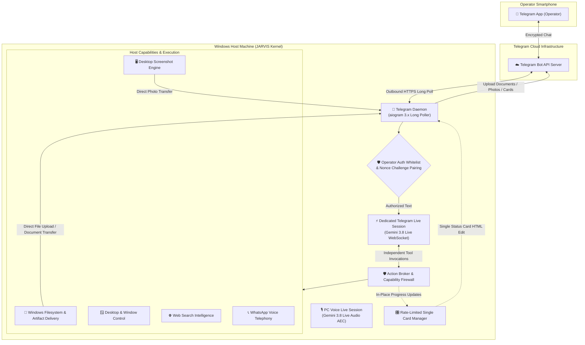

# Native Telegram Remote Control Architecture & User Guide

JARVIS features a native, host-resident **Telegram Remote Control Subsystem** that empowers the primary operator to securely interact with, supervise, and command the Windows JARVIS host from any mobile device running Telegram.

Powered by a **dedicated Gemini 3.8 Live session**, the Telegram agent possesses full conversational reasoning and can directly dispatch local Windows actions, capture desktop screenshots, search and deliver PC files, manage system volume, and trigger WhatsApp VoIP telephony.

---

## 1. Architectural Overview & Dual-Session Isolation

The Telegram subsystem runs as a trusted in-process daemon inside the core JARVIS operating system runtime. Crucially, the Telegram remote agent does **not** share state, audio buffers, or WebSocket connections with the PC voice session. Both operate concurrently and independently:



### Core Security & Architectural Invariants

1. **Zero Open Inbound Ports:**
   - Communicates strictly via outbound HTTPS long-polling (`getUpdates`).
   - No public IP, DNS domain, port forwarding, reverse proxies, ngrok, or Cloudflare tunnels required.
2. **Dedicated Cognitive Brain:**
   - Operates its own persistent **Gemini 3.8 Live session** (`gemini-3.8-live`).
   - Supports dedicated API keys via `TELEGRAM_GEMINI_API_KEY`, automatically falling back to `GEMINI_API_KEY` if unspecified.
3. **Fail-Closed Operator Boundary:**
   - Unregistered Telegram users receive an immediate access denial.
   - Internal filesystem paths, prompt context, and machine diagnostics are completely shielded.
4. **Cryptographic Single-Use Onboarding:**
   - Device pairing requires a 256-bit entropy challenge nonce generated on the Windows host.
   - Nonces have a strict time-to-live (default: 300 seconds) and are permanently invalidated once paired.
5. **64-Byte Telegram Callback Constraint:**
   - Inline approval action payloads (`[ ✅ AUTHORIZE ]` / `[ ❌ DENY ]`) use compact, opaque tokens (`appr:a:<token>`, `appr:d:<token>`) guaranteed to stay well within Telegram's strict 64-byte payload limit.
6. **Rate-Limited Single Status Cards:**
   - Running tasks maintain a single editable status message updated in place.
   - Prevents chat flooding, maintains a clean conversation log, and respects Telegram API 429 rate limits.
7. **Direct Artifact Delivery & Path Safety:**
   - Operators can request files stored on the host (e.g., presentations, spreadsheets, PDFs).
   - Artifacts are verified against filesystem safety boundaries (`is_safe_artifact_path`), resolved, and uploaded directly to the Telegram chat.

---

## 2. Configuration & Setup

### Step 1: Create Your Bot via BotFather

1. Open Telegram and message [@BotFather](https://t.me/BotFather).
2. Send `/newbot` and follow the prompts to choose a display name and username (e.g., `MyJarvisHostBot`).
3. Copy the HTTP API token provided by BotFather (e.g., `1234567890:ABCdefGhIJKlmNoPQRstuVWxYz_123456`).
4. Keep this token secret.

### Step 2: Configure Environment Variables

Add the token to your local `.env` file (copied from `.env.example`):

```bash
# Telegram Bot Token from @BotFather (Required for Telegram)
TELEGRAM_BOT_TOKEN="1234567890:ABCdefGhIJKlmNoPQRstuVWxYz_123456"

# (Optional) Dedicated Gemini API Key for Telegram Remote Control
# If unset, JARVIS automatically uses GEMINI_API_KEY
TELEGRAM_GEMINI_API_KEY=
```

---

## 3. Pairing Your Mobile Device

To ensure only you can control your PC, JARVIS uses a secure one-time pairing handshake:

1. On your Windows machine, run:
   ```powershell
   python -m jarvis.cli telegram pair
   ```
2. The CLI will generate a secure one-time pairing challenge and deep-link:
   ```text
   === JARVIS TELEGRAM PAIRING CHALLENGE ===
   Pairing Code: 7f8b9c... (256-bit nonce)
   Pairing Link: https://t.me/MyJarvisHostBot?start=7f8b9c...
   This link expires in 300 seconds.
   Open this link on your phone in Telegram and tap 'Start'.
   ```
3. Tap the link on your mobile phone and press **Start** in Telegram.
4. JARVIS confirms the link:
   ```text
   ✅ JARVIS PAIRED SUCCESSFULLY
   Welcome, Operator. You are now authorized to remotely control JARVIS.
   ```
5. Your numeric Telegram ID is stored in the local SQLite database.

---

## 4. In-Chat Capabilities & Usage

Once paired, you can message JARVIS just like you speak to it at your PC.

### Direct File Search & Delivery
Ask JARVIS to find and deliver files from your Windows PC directly into your mobile chat:
- *"Can you look for a file named java pbl in my downloads?"*
- *"Send me the presentation one."*
- *"Deliver the latest expense report PDF."*

JARVIS locates the file on your Windows drive, verifies access permissions, packages the document, and uploads it directly to the Telegram chat.

### Desktop Visual Snapshot
Send `/screenshot` to receive a real-time full-resolution capture of your primary Windows display.

### Host Automation & Media Control
- **Volume & Sound:** *"Set system volume to 25%"*, *"Mute the audio"*, *"Unmute audio"*.
- **Security:** *"Lock my PC"* locks the Windows workstation immediately.
- **Process Management:** *"What applications are running?"*, *"Kill notepad.exe"*.
- **Web Search:** *"Search the web for the latest Python release"*.

### Autonomous WhatsApp Telephony
- **Status:** *"Check WhatsApp connection status"*.
- **Place Call:** *"Call 9876543210 and ask if they are attending the seminar today"*.
- **Authentication:** *"Log out of WhatsApp"* or *"Initiate WhatsApp login"* to receive a QR code.

### Interactive Approvals
When an action involves sensitive side-effects (e.g. deleting files, executing arbitrary shell commands), JARVIS renders an interactive card with `[ ✅ AUTHORIZE ]` and `[ ❌ DENY ]` inline buttons. Tapping either button resolves the permission gate immediately.

---

## 5. Command Reference

### Bot Slash Commands
| Command | Action |
| :--- | :--- |
| `/start` | Welcome message and authentication verification |
| `/status` | Check host connectivity, paired operators, and system health |
| `/screenshot` | Capture and upload an instant desktop screenshot |
| `/help` | Detailed list of supported remote capabilities |
| `/unpair` | Revoke current device authorization from the phone |

### Host CLI Commands
| Command | Action |
| :--- | :--- |
| `python -m jarvis.cli telegram pair` | Generate a new 256-bit pairing challenge link |
| `python -m jarvis.cli telegram status` | Display operator pairing state and bot health |
| `python -m jarvis.cli telegram status --json` | Output machine-readable JSON status |
| `python -m jarvis.cli telegram unpair` | Revoke all paired mobile devices from the host |
| `python -m jarvis.cli telegram daemon` | Launch the standalone Telegram daemon |
| `run.bat` or `python -m jarvis.cli serve` | Launch unified background server (Gateway + Telegram) |
