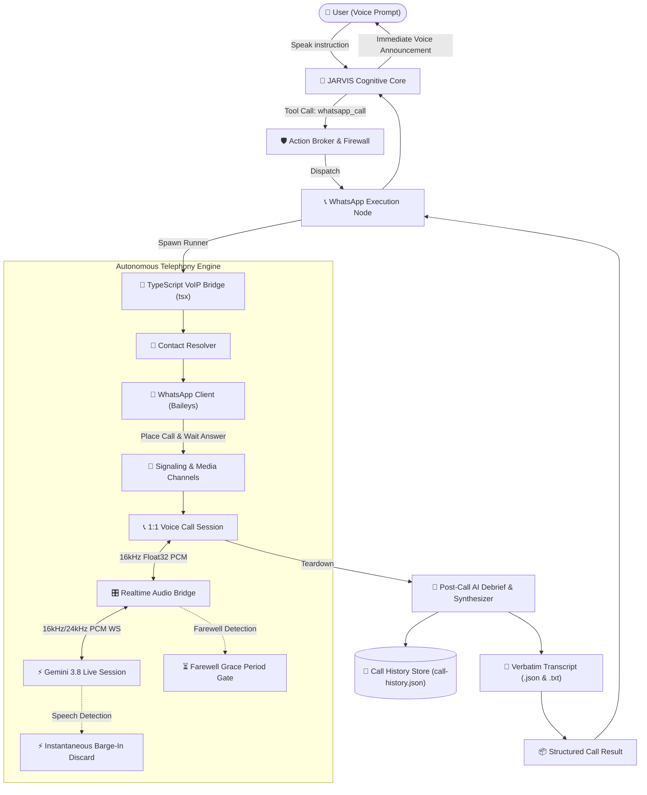
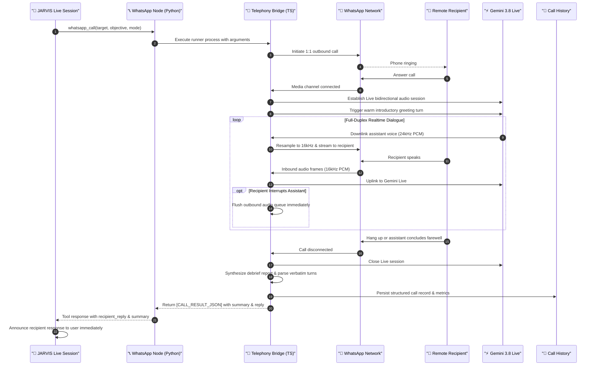

# Autonomous WhatsApp Voice Telephony Subsystem

## 1. Executive Overview

The **Autonomous WhatsApp Voice Telephony Subsystem** enables JARVIS to independently initiate and conduct full-duplex, goal-oriented outbound voice phone calls over the WhatsApp network on behalf of the user.

Unlike conventional chatbot integrations that only send text notifications, this subsystem integrates a low-latency WebRTC media bridge directly with the **Gemini 3.8 Live API**. It carries out natural, bidirectional voice conversations, handles user barge-in interruptions instantaneously, debriefs the outcome, and writes verified facts into persistent conversational memory.

---

## 2. Telephony Architecture

The subsystem spans a TypeScript VoIP extension bridge running in Node.js paired with a native Python execution node registered in the JARVIS Action Broker:



---

## 3. End-to-End Call Lifecycle

The complete sequence of an autonomous voice call proceeds as follows:



---

## 4. Key Functional Components

### 4.1 Contact Resolution (`contacts/resolver.ts` & `voice_caller.py`)
- Resolves phone numbers dynamically without rigid formats.
- Supports canonical E.164 formatting, 10-digit national parsing with configurable country codes (`DEFAULT_COUNTRY_CODE`, defaults to `91`), and custom contacts aliases (`data/whatsapp/contacts.json`).

### 4.2 Web Device Authentication & QR Rendering (`whatsapp/client.ts`)
- Utilizes multi-device session credentials stored in `data/whatsapp/auth/`.
- First-time setup or credential reset automatically renders an interactive, styled HTML QR code viewer at `data/whatsapp/login_qr.html` and launches it in the default system browser.
- Emits real-time connection status once linked from the mobile device.

### 4.3 Full-Duplex Realtime Audio Bridge (`bridge/realtime-audio.ts`)
- **Format Conversion:** High-speed in-memory translation between WhatsApp Float32 and Gemini Int16 PCM.
- **Resampling:** Bidirectional resampling between 16kHz telephone audio and 24kHz Gemini high-fidelity output.
- **Barge-In Clearance:** Detects user speech and clears buffered outbound audio queues to eliminate awkward robotic speech overlap.
- **Dual-Phase Farewell Gate:** Listens for conversational farewell triggers (e.g., "goodbye", "alvida", "take care") with a cancellable grace period that keeps the call active if the recipient re-engages.

### 4.4 Debriefing & Grounded Memory (`chat/reporter.ts` & `memory/call-history.ts`)
- Extracts the recipient's verbatim statements from the raw transcript.
- Generates a grounded conversational summary and structured action items using Gemini Live or Flash models.
- Features a strict zero-hallucination fallback: if generative debriefing times out, recipient turns are synthesized directly from verbatim transcript entries.
- Automatically appends structured call logs to `data/whatsapp/logs/call-history.json`.

---

## 5. Available Tools & Capabilities

The following capabilities are registered in the Action Broker and exposed directly to Gemini Live:

| Capability | Tool Name | Scope & Behavior |
| :--- | :--- | :--- |
| `whatsapp.call` | `whatsapp_call` | Initiates an outbound voice call. Blocks until the call finishes, then returns duration, summary, and recipient reply. |
| `whatsapp.history` | `whatsapp_get_latest_call` | Retrieves the outcome, recipient reply, and summary of previous completed calls from memory. |
| `whatsapp.status` | `whatsapp_status` | Inspects connection state, authentication status, and configuration paths. |
| `whatsapp.login` | `whatsapp_login` | Generates a new QR code for device pairing and launches the browser viewer. |
| `whatsapp.logout` | `whatsapp_logout` | Safely purges local authentication tokens and resets session credentials. |

---

## 6. CLI Usage

The subsystem can be inspected and controlled directly via the command-line interface:

```bash
# Check WhatsApp connection and authentication state
python -m jarvis.cli whatsapp status

# Generate QR code for device authentication
python -m jarvis.cli whatsapp login

# Place an autonomous voice call to a contact or phone number
python -m jarvis.cli whatsapp call --target "+919876543210" --objective "Ask if they are coming to college tomorrow"

# View recent completed call history and recipient responses
python -m jarvis.cli whatsapp history --limit 5

# Search past call history by keyword
python -m jarvis.cli whatsapp search "college"

# Log out and clear saved authentication tokens
python -m jarvis.cli whatsapp logout
```

---

## 7. Environment Variables & Configuration

All parameters are dynamic and configurable via `.env`:

```ini
# Enable/disable WhatsApp autonomous voice telephony
WHATSAPP_VOIP_ENABLED=true

# Dynamic conversation mode: MESSAGE_DELIVERY | CONVERSATIONAL | EMERGENCY
WHATSAPP_CONVERSATION_MODE=MESSAGE_DELIVERY

# Default telephony timeout in milliseconds (120000 = 2 minutes)
WHATSAPP_CALL_TIMEOUT_MS=120000

# Default national dialing country code
WHATSAPP_DEFAULT_COUNTRY_CODE=91

# Preferred dialogue language: hinglish | english | hindi
WHATSAPP_CALL_LANGUAGE=hinglish

# Directory for persistent multi-device credentials
WHATSAPP_AUTH_DIR=data/whatsapp/auth

# Optional custom contacts lookup dictionary
WHATSAPP_CONTACTS_FILE=data/whatsapp/contacts.json
```
