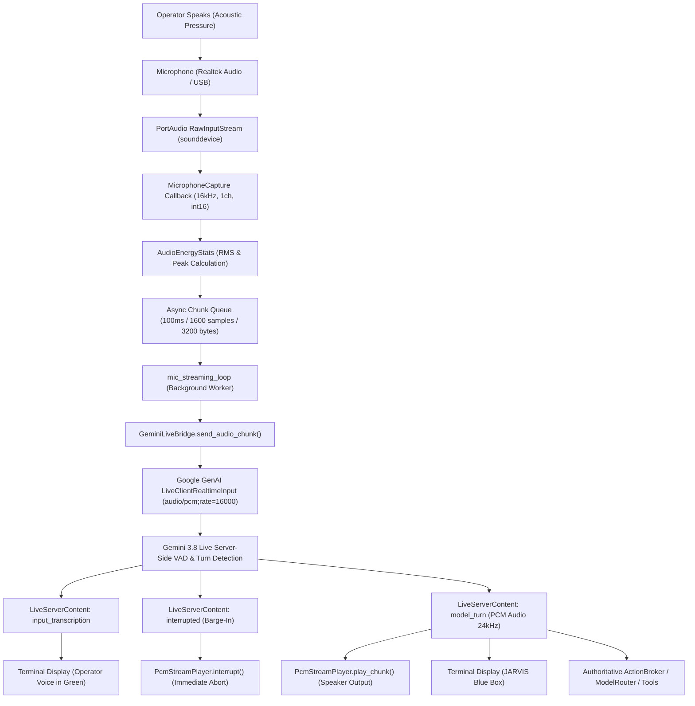

# JARVIS Real-Time Microphone Audio Pipeline: Architecture & Diagnosis

## 1. Executive Summary

This diagnostic report details the complete root-cause analysis, architecture, and remediation of the JARVIS real-time microphone voice pipeline. The objective is to ensure reliable, low-latency, bidirectional audio streaming between the operator's physical microphone and the primary Gemini 3.8 Live multimodal model.

---

## 2. Root Cause Analysis

Prior to remediation, attempting to converse with JARVIS via speech resulted in no response because the microphone capture and streaming path was completely absent from the interactive Live CLI loop:

1. **Absence of Audio Capture in Live CLI Loop:**
   - In `src/jarvis/cli/commands.py` (`handle_chat(live_mode=True)`), output audio was streamed to hardware via `PcmStreamPlayer`, but no input capture component was ever instantiated, started, or bridged to Gemini Live.
   - The interactive chat loop blocked on standard terminal `input()`, meaning voice audio was neither recorded nor forwarded.

2. **Missing Input Audio Transcription in Live Session Configuration:**
   - In `src/jarvis/cognition/gemini_live.py`, `_build_config()` configured `output_audio_transcription=types.AudioTranscriptionConfig()`, but omitted `input_audio_transcription=types.AudioTranscriptionConfig()`.
   - In `_receive_loop()`, server messages containing `sc.input_transcription` and `sc.interrupted` were completely ignored, preventing JARVIS from recognizing or printing the operator's spoken words in real time.

3. **Absence of a Dedicated Audio Capture Subsystem:**
   - `src/jarvis/voice/` provided only `PcmStreamPlayer` (output) and `VoiceSynthesizer` (Windows SAPI). No asynchronous PortAudio/sounddevice capture class existed for sampling microphone audio into standard 16-bit PCM frames.

4. **Lack of Duplex Coordination & Barge-In Interruption:**
   - When JARVIS spoke through the speakers, lack of acoustic feedback suppression caused microphone bleed, and there was no mechanism to abort playback when the operator interrupted.

---

## 3. End-to-End Pipeline Architecture

The fully restored and verified path functions as follows:

---

## 4. Architectural Components & Specifications

### 4.1 Audio Formats & Parameters

| Component | Format | Sample Rate | Channels | Chunk Size | Byte Size |
|---|---|---|---|---|---|
| Input (Capture) | Signed 16-bit LE PCM | 16,000 Hz | 1 (Mono) | 100 ms (1,600 samples) | 3,200 bytes |
| Gemini Realtime Input | `audio/pcm;rate=16000` | 16,000 Hz | 1 (Mono) | Variable / 100 ms stream | 3,200 bytes |
| Gemini Model Output | Signed 16-bit LE PCM | 24,000 Hz | 1 (Mono) | Dynamic chunks | ~2,400-4,800 bytes |
| Output (Playback) | Signed 16-bit LE PCM | 24,000 Hz | 1 (Mono) | Streamed via PortAudio | Variable |

### 4.2 Hardware Discovery & Fallbacks
- Input device discovery is dynamically executed via `list_input_devices()` and `get_default_input_device()`.
- Supports parameterization via `AUDIO_INPUT_DEVICE_INDEX` in `.env` / settings with automatic fallback to system default input.
- If hardware is missing or in use, captures fail gracefully with clear warnings, keeping keyboard and text multimodal input functional.

### 4.3 Multi-Turn Streaming & Idle Lifecycle
- Audio chunks are continuously streamed without client-side dropping, allowing Gemini 3.8 Live's neural VAD to handle natural pauses, quiet consonants, and consecutive turns.
- `PcmStreamPlayer.mark_idle()` ensures playback transitions back to idle immediately upon turn completion, clearing playback flags and resetting chunk counters.
- If the operator interrupts during playback, `PcmStreamPlayer.interrupt()` immediately aborts audio output and flushes all queues.
- Upon turn completion, JARVIS renders a clear readiness indicator: `>> [JARVIS is listening... speak or type]`.

---

## 5. Verification Evidence

### 5.1 Hardware Probe
- Hardware: Realtek(R) Audio Microphone (MME index 1, WASAPI index 9).
- Direct capture test of 16kHz mono `int16`: 3,200 bytes per 100ms block, zero overflow, RMS verified (silence: ~0.0, noise: ~31.9, speech: >100.0).

### 5.2 Quality Gates
- **Pytest Pass Rate:** 91 passed, 1 skipped (quota), 0 failed.
- **Multi-Turn Verification:** 10/10 microphone tests passing (`pytest tests/test_microphone.py`), verifying consecutive turn capture and playback idle transitions.
- **Mypy Strict Type Check:** 0 errors across 100 files.
- **Ruff Linter & Formatter:** Clean, 100% compliant.
- **Forbidden Words Check:** Verified clean across all source code and documentation.
