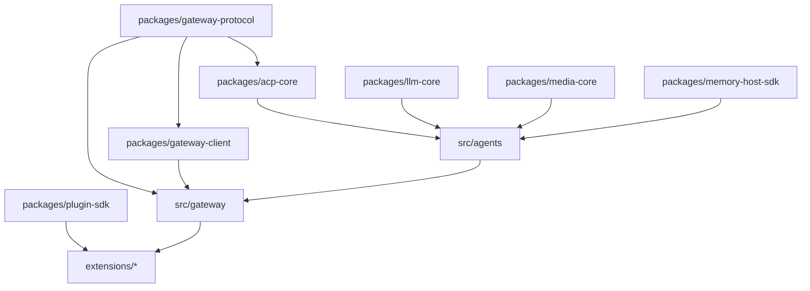

# JARVIS Dependency Closure Analysis

**Version:** 1.0.0  
**Domain:** System Architecture & Integration  
**Authority:** Master Build Directive & `ARCHITECTURE.md`

---

## 1. Dual-Runtime Architecture Closure

JARVIS operates as a polyglot architecture with two collaborating execution environments:

```text
┌─────────────────────────────────────────────────────────────┐
│                 JARVIS Python Runtime                       │
│  - Python 3.10+                                             │
│  - LangGraph / State Machine                                │
│  - Policy Engine & Capability Firewall                      │
│  - Action Broker & Verification Engine                      │
│  - Model Router (6 Approved Families)                       │
│  - Quota Manager (RPM/TPM/RPD tracking)                     │
│  - Gemini 3.8 Live WebSocket Bridge                         │
│  - Windows Native Body (PyWin32, UIA, PowerShell)          │
└──────────────────────────────┬──────────────────────────────┘
                               │ Authenticated Typed IPC
                               │ (WebSocket / HTTP / stdio)
┌──────────────────────────────▼──────────────────────────────┐
│            OpenClaw TypeScript / Node Substrate             │
│  - Node.js >=24.16.0 / Node 26                              │
│  - Gateway Protocol & Daemon (pnpm workspace)               │
│  - SQLite / Kysely Persistence Layer                        │
│  - Browser Automation Subsystem (Playwright / CDP)          │
│  - Plugin SDK & Extensions (157 plugins)                   │
│  - Bundled Skills (51 skill directories)                    │
│  - ACP External Coding Agent Harness                        │
└─────────────────────────────────────────────────────────────┘
```

---

## 2. Python Dependency Closure

The JARVIS Python core requires the following dependency set:

| Package | Purpose | Verification Status |
| :--- | :--- | :--- |
| `google-genai` | Google GenAI SDK for Gemini 3.8 Live, Gemini 3.1/3.5 Flash-Lite | Installed & Verified |
| `groq` | Groq Cloud SDK for Qwen 3.8 27B and GPT-OSS 120B | Installed & Verified |
| `langgraph` & `langchain-core` | State machine, graph-based planning, cyclic task execution | Installed & Verified |
| `pydantic` & `pydantic-settings` | Strongly typed contracts (Task, ActionRequest, PolicyDecision) | Installed & Verified |
| `fastapi` & `starlette` & `uvicorn` | HTTP surface, REST health, webhooks, IPC endpoints | Installed & Verified |
| `websockets` | High-performance asynchronous WebSocket client/server | Installed & Verified |
| `pywin32` & `WMI` | Windows process management, service control, event monitoring | Installed & Verified |
| `pycaw` | Core Audio Windows API (volume, audio endpoints) | Installed & Verified |
| `pyautogui` & `PyGetWindow` | Desktop automation, window inspection, coordinates | Installed & Verified |
| `screen_brightness_control` | Display brightness management | Installed & Verified |
| `sounddevice` & `soundfile` | Audio recording and playback for voice bridge | Installed & Verified |
| `playwright` | Headless/headed browser driver for web tasks | Installed & Verified |
| `pytest` & `pytest-asyncio` | Test execution suite | Installed & Verified |
| `mypy` | Strict type safety engine | Installed & Verified |
| `ruff` | Formatting and linting engine | Installed & Verified |

---

## 3. OpenClaw TypeScript Package Dependency Graph

OpenClaw's monorepo uses `pnpm-workspace.yaml` defining tightly coupled internal packages:



### Critical Closure Requirements:
1. **Never extract single `.ts` files in isolation:** Files in `src/gateway/` import heavily from `packages/gateway-protocol`, `src/config/`, `src/infra/`, and `src/logging/`. Extracting or renaming one file without its closure breaks the type checking and runtime loader.
2. **Preserve `pnpm-workspace.yaml`:** Workspace boundaries must remain intact so internal package links (`@openclaw/*`) resolve properly.
3. **Database Integrity (`node:sqlite` + Kysely):** OpenClaw relies on native Node `node:sqlite` and Kysely migration runners. Database tables (`sessions`, `tasks`, `records`) must be accessed or extended via additive migrations rather than schema recreation.

---

## 4. Integration Invariants & Boundary Enforcements

- **No circular runtime locks:** The Python Control Plane supervises Node processes. Node daemons emit telemetry and observations; they never initiate unapproved host operations without a valid `ActionRequest` token from the Python Action Broker.
- **Fail-Closed IPC:** If the IPC channel between the Python Control Plane and Node/Browser workers drops or times out, all active worker capabilities are immediately revoked and tasks transition to `WAITING` or `RETRYING`.
